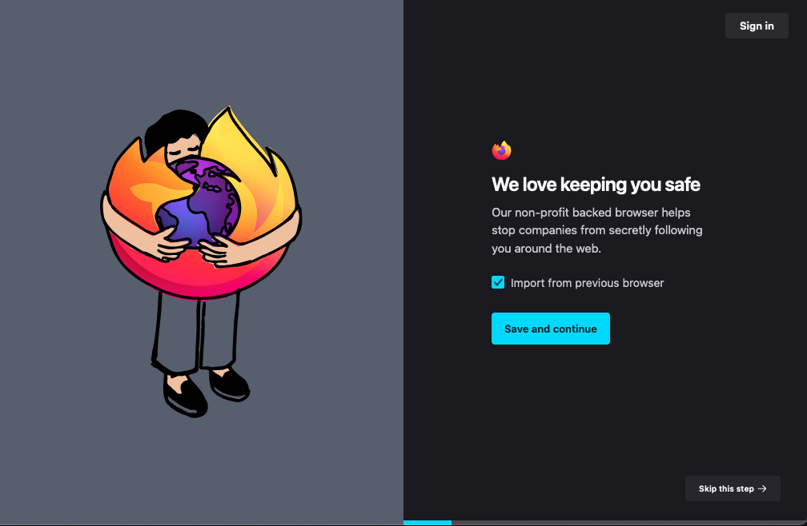
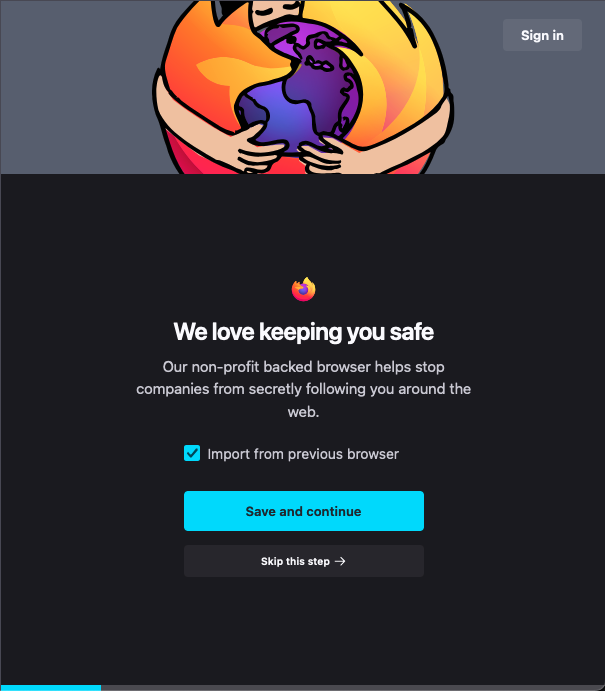
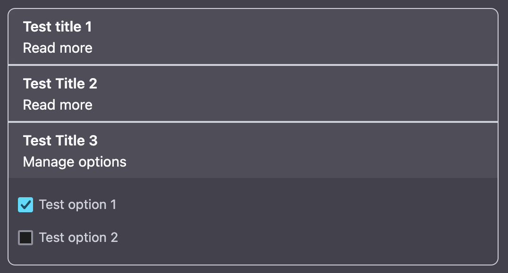
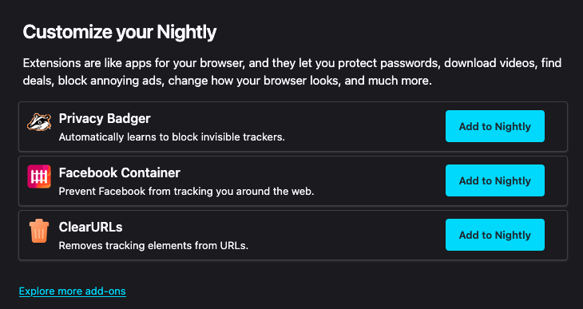
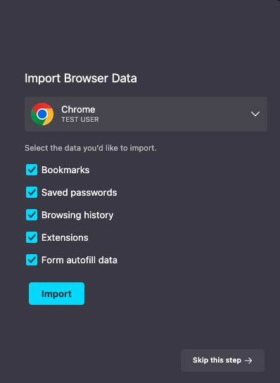
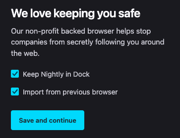
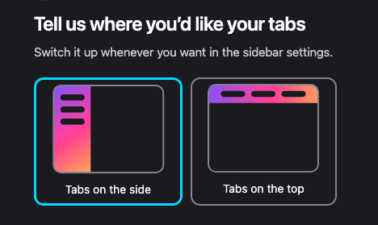
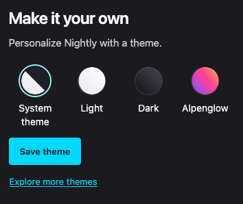

# About Welcome

## Overview
The About Welcome page is a full-screen, multi-step onboarding experience that appears for most new users after successfully installing Firefox. Exceptions include users on Enterprise builds or custom configurations where this experience is disabled on first startup.

The onboarding experience on `about:welcome` displays screens in the following precedence order:
- Has AMO attribution
  - [Return to AMO](https://firefox-source-docs.mozilla.org/browser/components/asrouter/docs/first-run.html#return-to-amo-rtamo) custom onboarding screens
- Experiments
- `MR_ABOUT_WELCOME_DEFAULT` [screens](https://searchfox.org/mozilla-central/rev/3b707c8fd7e978eebf24279ee51ccf07895cfbcb/browser/components/newtab/aboutwelcome/lib/AboutWelcomeDefaults.jsm#523) selected by dynamic rules inside the [prepareContentForReact](https://searchfox.org/mozilla-central/rev/3b707c8fd7e978eebf24279ee51ccf07895cfbcb/browser/components/newtab/aboutwelcome/lib/AboutWelcomeDefaults.jsm#577) method. Each screen's visibility can be dynamically configured through the screen-level targeting ([see example](https://searchfox.org/mozilla-central/rev/3b707c8fd7e978eebf24279ee51ccf07895cfbcb/browser/components/newtab/aboutwelcome/lib/AboutWelcomeDefaults.jsm#90)).

The [Spotlight messaging surface](https://firefox-source-docs.mozilla.org/browser/components/asrouter/docs/spotlight.html) can be configured to show `about:welcome` screens in a modal format by using [exposed window.AW* interfaces](https://searchfox.org/mozilla-central/source/browser/base/content/spotlight.js#28-47). These interfaces expose top level functions expected by the About Welcome bundle and allow for custom handling as needed. This [Unified Onboarding](https://docs.google.com/document/d/1o8W-gEkgw2GC7KFSfQRkKfWzNJg1-6fpkVPrYmmot4Y/edit) approach enables reusing `about:welcome` as a rendering engine for multiple messaging surfaces such as Spotlight and [Feature Callout](https://firefox-source-docs.mozilla.org/browser/components/asrouter/docs/feature-callout.html).

## Testing about:welcome Screens

### Testing with the Screens Pref
1. Go to `about:config`, search for the `browser.aboutwelcome.screens` pref and set it to the array of screen values to be used in a JSON recipe.
2. Go to about:welcome and you should see the newly configured screen(s)

**Note:** If you are enrolled in an About Welcome nimbus experiment, the screens you set in the pref will not appear. You can see your current enrollments at `about:studies`.

### Testing with Experiments
You can test custom `about:welcome` UI by creating an experiment. [Messaging Journey](https://experimenter.info/messaging/desktop-messaging-journey) captures creating and testing experiments via Nimbus. Note that test experiments should be created in the Nimbus [staging environment](https://stage.experimenter.nonprod.webservices.mozgcp.net/nimbus/), not in production.

### Example JSON for Screens Property

You can see JSON for all current default screens in about:welcome [here](https://searchfox.org/mozilla-central/rev/3b707c8fd7e978eebf24279ee51ccf07895cfbcb/browser/components/newtab/aboutwelcome/lib/AboutWelcomeDefaults.jsm#38-454).

### Example about:welcome Screen

#### Browser View

#### Responsive View

### Content Tiles
Screens in about:welcome support a variety of content tiles. Typically, only one tile is displayed per screen. When necessary, multiple tiles can be included on one screen. Each tile can be configured with a header that describes the tile and reveals it when clicked (see example below).

#### Addons Picker
Displays a curated list of recommended add-ons that users can choose to install directly from the tile.

#### Migration Wizard
Guides users through the process of migrating their data, such as bookmarks, passwords, and browsing history, from another browser to Firefox.

#### Mobile Downloads
Encourages users to download Firefox on their mobile devices by providing QR codes, marketplace buttons for iOS or Android, and/or a link to a page where users can email themselves a download link.

#### Multiselect Checklist
Offers a checklist of actions a user can opt-in to.

#### Single Select Picker
Provides users with set of mutually exclusive options.

#### Theme Picker
Allows users to select from a set of themes to personalize the browser’s appearance.

