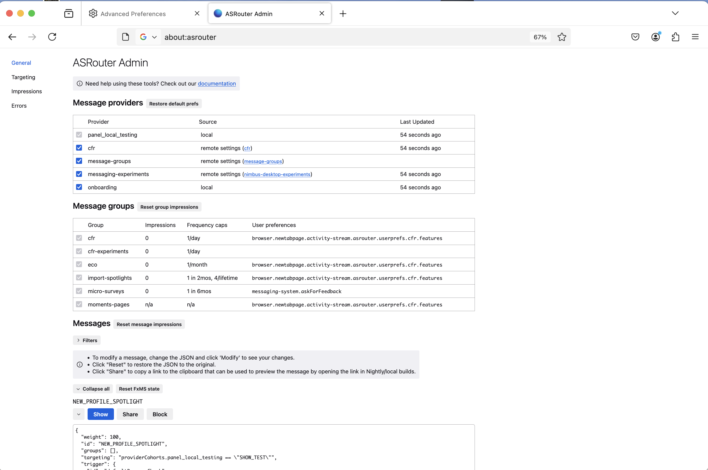
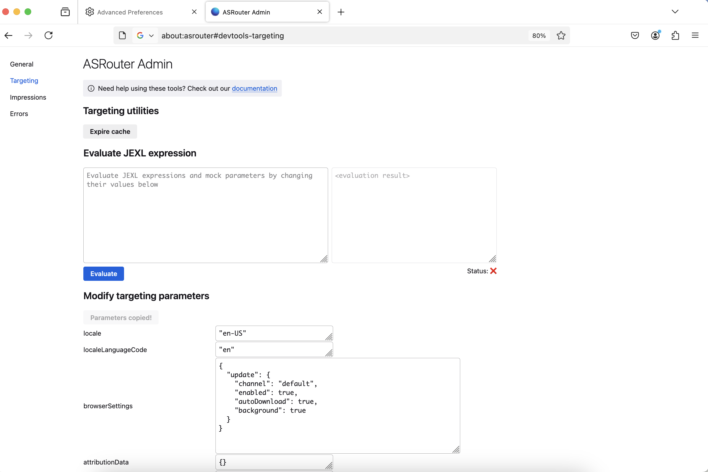
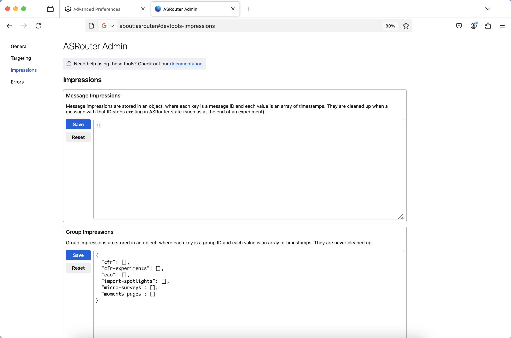

# Using ASRouter Devtools

## How to enable ASRouter devtools
- In `about:config`, set `browser.newtabpage.activity-stream.asrouter.devtoolsEnabled` to `true`
- Visit `about:asrouter`, or click on the wrench icon on a new tab.

## Overview

### How to enable/disable a provider

To enable a provider such as `cfr`, Look at the list of "Message Providers" at
the top of the General page. Make sure the checkbox is checked next to the
provider you want to enable.

To disable it, uncheck the checkbox. You should see a red label indicating the provider is now disabled.

### How to filter messages

In order to see all active messages for a current provider such as `cfr`, use
the drop down selector under the "Messages" section. Select the name of the
provider you are interested in. You can also filter messages based on the
template such as `spotlight` or by messaging group such as `eco`.

### How to preview a message

To preview a message in asrouter, simply click on the "Show" button on top of
the message.

## Targeting

The targeting section can be accessed by visiting
`about:asrouter#devtools-targeting` or selecting "Targeting" from the menu. It
enables you to evaluate JEXL expressions and modify targeting parameters.

1. Evaluating a JEXL Expression

 - In the "Evaluate JEXL expression" section, you will see a text area where you can enter your JEXL expression.
 - Once you've entered your expression, click the "Evaluate" button to process it.
 - The result will appear in a read-only text area next to the input field. If the evaluation is successful, a green checkmark (✅) will appear
  below the result. If it fails, a red cross (❌) will be shown instead.

2. Modifying Targeting Parameters

  - Below the expression evaluator, you'll find a list of targeting parameters. Each parameter is displayed in a table with its name and a text area where you can modify the value.
  - When you modify the values, the changes are automatically saved.
  - To copy all the current targeting parameters to your clipboard, click the
    "Copy parameters" button. The button will change to `Parameters copied!`
    afterwards.

3. Setting Attribution Parameters

 - The "Attribution parameters" section provides several fields where you can specify attribution data for testing purposes. These parameters include:
    * Source
    * Medium
    * Campaign
    * Content
    * Experiment
    * Variation
    * User Agent
    * Download Token

## Impressions

This section can be accessed by visiting `about:asrouter#devtools-impressions`
or selecting "Impressions" from the menu. It allows you to view and manage different types of impression data, such as
message impressions, group impressions, and screen impressions. You can edit and
reset these impressions.

1. Message Impressions

  - Message impressions are stored as an object where each key is a message ID,
    and each value is an array of timestamps. These impressions are cleaned up
    when a message with that ID is no longer available in ASrouter (such as when an
    experiment ends).
  - You can edit the JSON message impressions directly in the text area. After editing the JSON, click the "Save" button to apply the changes.
  - If you want to reset the message impressions to their default state, click the "Reset" button.

2. Group Impressions

 - Group impressions are stored as an object where each key is a group ID, and each value is an array of timestamps. Unlike message impressions, group impressions are not cleaned up.
 - You can edit the JSON for group impressions in the text area. Click the
   "Save" button to save your changes.
  - To reset the group impressions to their default state, click the "Reset" button.

3. Screen Impressions

 - Screen impressions are stored in an object where each key is a screen ID, and the corresponding value is the most recent timestamp that the screen was shown. These impressions are also not cleaned up.
 - You can modify the screen impressions by editing the JSON directly. Click the
   "Save" button to save your changes.
 - If needed, you can click the "Reset" button to restore the original screen impressions data.

## Errors

This section can be accessed by visiting `about:asrouter#devtools-errors` or
selecting "Errors" from the menu. If there are any providers with errors, an error table will be
displayed.

## How to test data collection

All of Messaging System, including ASRouter, is instrumented in Glean.
To test this instrumentation, please consult [this guide](/toolkit/components/glean/user/instrumentation_tests.md), and:

- In about:config, set:
  - `browser.newtabpage.activity-stream.telemetry` to `true`
- To view additional debug logs for messaging system or about:welcome, set:
  - `messaging-system.log` to `debug`
  - `browser.aboutwelcome.log` to `debug`
- You can now view telemetry logs in the browser console
