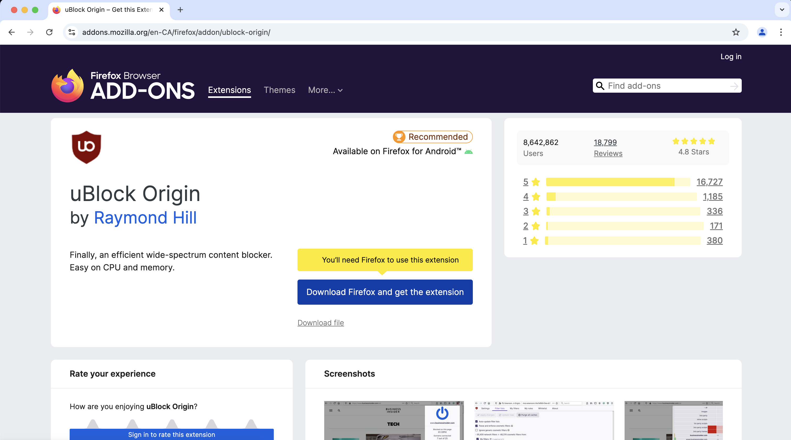
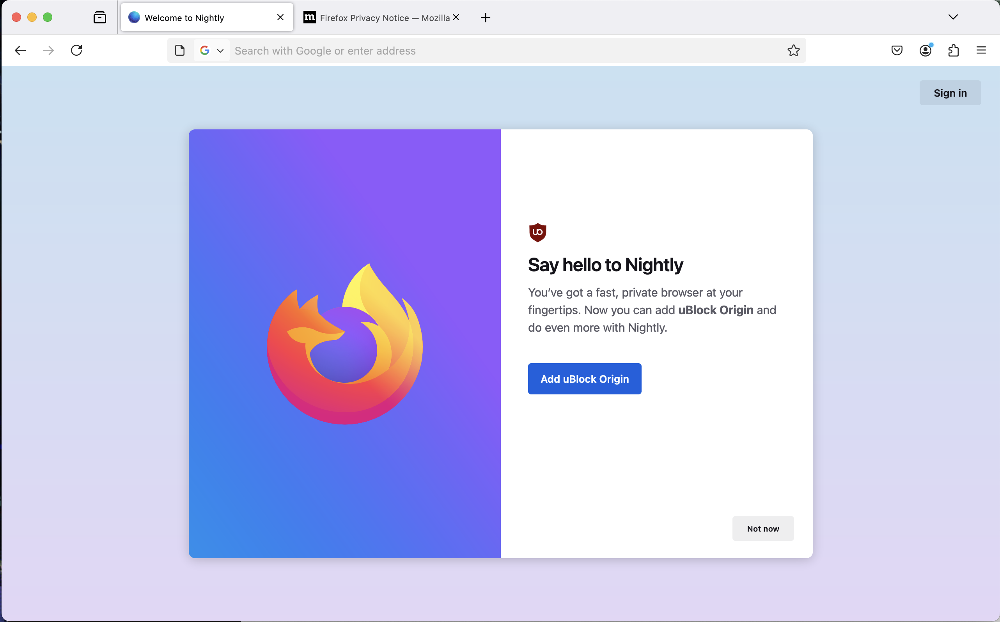

# Onboarding flow

Onboarding flow consists of the entire flow users see after Firefox has successfully been installed or upgraded.

For new users, the first instance of new tab shows relevant messaging on about:welcome. For existing users, an upgrade dialog with release highlights is shown on major release upgrades.

## New User Onboarding

A full-page multistep experience that shows up on first run since Fx80 with `browser.aboutwelcome.enabled` pref as `true`. Setting `browser.aboutwelcome.enabled` to `false` takes user to about:newtab and hides about:welcome.

### Default values

Multistage proton onboarding experience is live since Fx89 and its major variations are:

#### Zero onboarding

No about:welcome experience is shown (users see about:newtab during first run).

Testing instructions: Set `browser.aboutwelcome.enabled` to `false` in about:config

#### Proton (about:welcome)

A full-page multistep experience that shows a large splash screen and several subsequent screens. See [Default experience variations](#default-experience-variations) for more information.

#### Return to AMO ([RTAMO](https://docs.google.com/document/d/1QOJ8P0xQbdynAmEzOIx8I5qARwA-VqmOMpHzK9h9msg/edit?usp=sharing))

Special custom onboarding experience shown to users when they try to download an addon from addons.mozilla.org but don’t have Firefox installed. This experience allows them to install the addon they were trying to install directly from a button on about:welcome.

For example, a user who visited the `addons.mozilla.org` page for [UBlock Origin](https://addons.mozilla.org/firefox/addon/ublock-origin/) while using Google Chrome would see the following:

And if they install Firefox using that button, instead of the default about:welcome flow, the user would see:

Note that this uses [attribution data](https://docs.google.com/document/d/1zB5zwiyNVOiTD4I3aZ-Wm8KFai9nnWuRHsPg-NW4tcc/edit#heading=h.szk066tfte4n) added to the browser during the download process.

Testing instructions:
- Set pref browser.newtabpage.activity-stream.asrouter.devtoolsEnabled as true
- Open about:asrouter
- Click Targeting -> Attribution -> Force Attribution
- Open about:welcome, should display RTAMO page

The default values in the "Force Attribution" devtool point toward uBlock Origin; the demo addon can be changed by replacing the `content` value with the base64 encoded ID of any addon prefixed with `rta:` (ex. `rta:amlkMS1Nbm54Y3hpc0JQblNYUUBqZXRwYWNr`)

### General capabilities
- Run experiments and roll-outs through Nimbus (see [FeatureManifests](https://searchfox.org/mozilla-central/source/toolkit/components/nimbus/FeatureManifest.yaml#678)), only windows is supported. FeatureConfig (from prefs or experiments) has higher precedence to defaults. See [Default experience variations](#default-experience-variations)
- AboutWelcomeDefaults methods [getDefaults](https://searchfox.org/mozilla-central/source/browser/components/aboutwelcome/modules/AboutWelcomeDefaults.sys.mjs#862) and [prepareContentForReact](https://searchfox.org/mozilla-central/rev/f2df1ff64cb876e10c72ce7eed1fc9eac3f877bb/browser/components/aboutwelcome/modules/AboutWelcomeDefaults.sys.mjs#909) have dynamic rules which are applied to both experiments and default UI before content is shown to user.
- about:welcome only shows up for users who download Firefox Beta or release (currently not enabled on Nightly)
- [Enterprise builds](https://searchfox.org/mozilla-central/rev/f2df1ff64cb876e10c72ce7eed1fc9eac3f877bb/browser/components/enterprisepolicies/Policies.sys.mjs#1710) can turn off about:welcome by setting the browser.aboutwelcome.enabled preference to false.

### Default experience variations
In order of precedence:
- Has AMO attribution
   - Return to AMO
- Experiments (fetched from Nimbus)
- Defaults
  - [Proton default content](https://searchfox.org/mozilla-central/rev/964b8aa226c68bbf83c9ffc38984804734bb0de2/browser/components/aboutwelcome/modules/AboutWelcomeDefaults.sys.mjs#40) with screens chosen from the below options based on screen-level targeting:
    - "Welcome Back" device migration screen (shows when `isDeviceMigration` is true)
    - "Easy Setup" Screen with options to 'Pin Firefox', 'Set default' or 'Import from previous browser', depending on what actions are needed
    - "Language Mismatch" screen which shows when the users system language does not match the download language of Firefox, and offers to download the correct language
    - "Import" screen which shows when the "Import" option was selected on the "Easy Setup" screen, and allows user to import password, bookmarks and browsing history from a previous browser or from file.
    - "Mobile Download" screen which shows a QR code for downloading Firefox for Mobile
    - "Addons Picker" screen which offers a few recommended addons for installation (currently only shows in en-* locales)
    - "Gratitude" screen with a "Start Browsing" CTA.

## Upgrade Dialog
Upgrade Dialog was first introduced in Fx89 with MR1 release, and was subsequently used again in the Fx106 MR2022 release. It replaces whatsnew tab with an upgrade modal explaining proton changes, setting Firefox as default and/or pinning, and allowing theme change. Upgrade Dialog has been disabled since Fx117.

### Feature Details:
- Hides whatsnew tab on release channel when Upgrade Modal is shown
- Modal dialog appears on major version upgrade to 106.
  - It’s a window modal preventing access to tabs and other toolbar UI
- Supports desired content and actions on each screen, similar to about:welcome. Current defaults show screens for pin, set default, import, mobile, private pin, and data recommendations.

### Testing Instructions:
- Go to `about:studies` and ensure that the "Upgrade Spotlight Rollout" study is removed.
- In `about:config`, set:
  - `browser.startup.upgradeDialog.enabled` to `true`.
  - `browser.startup.homepage_override.mstone` to `105`. The dialog only shows after it detects a major upgrade.
  - Ensure pref `browser.startup.homepage_override.buildID` is empty.
  - Ensure pref `browser.startup.upgradeDialog.version` is empty. After the dialog shows, `browser.startup.upgradeDialog.version` remembers what version of the dialog to avoid reshowing.
- Restart Firefox
