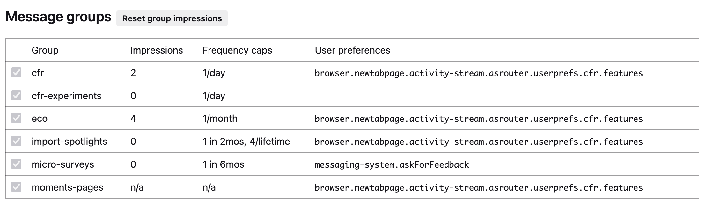

# Frequency and Frequency Caps

## Message Frequency
How often and how many times a user should see a message is configured through frequency. These message configurations can help prevent overexposure and reduce the risk of user messaging fatigue. Frequency is configured at the message level, based on impressions, and consists of the following components:

- `frequency`: the number of times a message can be shown in a given period. This can be any period of time, but the most common ones are daily or weekly
  - `lifetime`: the number of times message can ever be shown until it is permanently blocked
  - `cap`: the number of times the message can be shown within the period
  - `period`: The period of time in milliseconds. For example, 24 hours is 86400000.

```
  frequency?: {
    lifetime?: number;
    custom?: Array<{
      cap: number;
      period: number;
    }>;
  };
```

### Examples

Lifetime cap of 1. The message will only ever be shown once.

```
frequency: {
  lifetime: 1
}
```

Lifetime cap of 3, weekly cap of 1. The message will be shown a maximum of once a week, three times in total.
```
frequency: {
  custom: [
  {
    cap: 1,
    period: 86400000 * 7 // Max 1 per week
  }
  ],
  lifetime: 3
}
```

Lifetime cap of 10, weekly cap of 3, and daily cap of 1. The message will be shown a maximum of 3 times per week but not more than once per day, and 10 times in total.

```
frequency: {
  custom: [
  {
    cap: 1,
    period: 86400000 // Max 1 per day
  },
  {
    cap: 3,
    period: 86400000 * 7 // Max 3 per week
  }
  ],
  lifetime: 10
}
```

## Message Groups
In addition to frequency capping at the message level, we also use message groups to manage frequency limits across multiple messages. For example, if two messages share a similar theme or content but appear on different surfaces, they can be assigned to the same group using the `groups` field in the message configuration.

```
  groups?: string[];
```

When messages are part of the same group, any impression from one message contributes to the group's total frequency cap. For instance, if the group frequency is set to one impression per day (`cfr` group), displaying one message will block all other messages in the group from appearing for the next 24 hours. This ensures cohesive and consistent control over how often related messages are shown to users. The most commonly used message groups include:

* `eco` - One message per month
* `cfr` - One message per day

You can view and manage the current state of a profile's messaging group impressions and individual message impressions, as well as reset these states. To enable this functionality:

1. Navigate to `about:config` and set `browser.newtabpage.activity-stream.asrouter.devtoolsEnabled` to `true` to enable ASRouter devtools
2. Open `about:asrouter`

In the **Message Groups** section, you can:
- View the current frequency caps for message groups
- Reset the state of these caps



In the **Messages** section, you can:
- View the current number of impressions for individual messages
