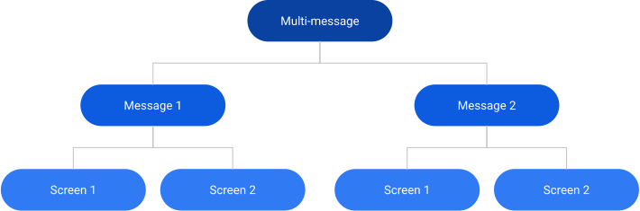

# Multi-Message

`multi` is a special tooling template that can contain an array of multiple messages, each with its own triggers and targeting, completely independent of the other messages. This is not the same thing as a single message with multiple _screens_, although multi-messages can contain messages that have multiple screens.

```ts
interface MultiMessage {
  template: "multi";
  messages: Array<{
    id: string;
    template: string;
    content: object;
  }>;
}
```

When the messaging system encounters a message with `template: "multi"`, it flattens the message’s `messages` array and adds each of the child messages to the messaging system, as an independent message. The "wrapper" with `template: "multi"` is then discarded. There is no limit on the number of messages that can be included. Each individual message can be of any other template, and they do not need to share the same template. However, `multi` messages cannot be nested _inside_ other `multi` messages.

This pattern has a specialized purpose. Normally, when adding messages to the Firefox messaging system (in the source code), there is no reason to wrap multiple messages in a single message, because you can just add multiple messages directly to one of the local message providers. But this pattern comes into play when running a messaging experiment through Experimenter that needs to provide multiple messages.

For example, this is needed for experiments that roll out a large feature requiring multiple onboarding messages, callouts, reminders, etc. Nimbus experiments have a [branch](messaging-glossary.rst#Treatment-Branch) structure, where each user can only be enrolled in one branch at a time, and each branch’s value must be an object. This template provides a way to include multiple messages in a single feature value on a single branch.

Since the most commonly used message templates support multi-screens, it’s relatively common for a multi-message experiment to include messages that have multiple screens. In that case, each branch contains multiple messages, and each message contains multiple screens. It can be thought of in the same way as a folder structure:



## Examples

```json
{
  "template": "multi",
  "messages": [
    {
      "id": "EXAMPLE_WHATS_NEW_PAGE",
      "template": "update_action",
      "content": {
        "action": {
          "id": "moments-wnp",
          "data": {
            "url": "https://www.mozilla.org/%LOCALE%/etc/firefox/retention/thank-you-a/",
            "expire": 1730162684253
          }
        }
      },
      "trigger": { "id": "momentsUpdate" }
    },
    {
      "id": "EXAMPLE_SPOTLIGHT",
      "template": "spotlight",
      "content": {
        "template": "multistage",
        "backdrop": "transparent",
        "screens": [
          {
            "id": "EXAMPLE_SPOTLIGHT",
            "content": {
              "title": { "raw": "Hello, Firefox!" },
              "primary_button": {
                "label": { "string_id": "some-fluent-id" },
                "action": { "navigate": true }
              }
            }
          }
        ]
      }
    }
  ]
}
```
