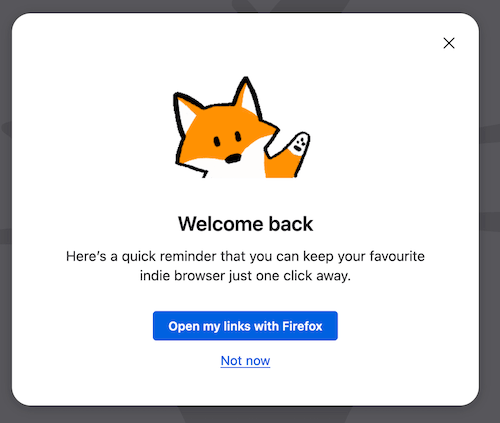

# Spotlight
 By default, Spotlights are `'window'` modals that prevent interaction with other browser elements, including tab opening and switching. Configuring a Spotlight as a `'tab'` modal allows interaction with browser tabs while displaying the message over the current content.

 Spotlights can be configured as single or multi-screen displays. They support various presentation elements, including a title, subtitle, image, and backdrop, as well as interactive elements like primary and secondary buttons and checkbox-styled radio buttons. For a list of currently available actions that can be paired with these interactive elements, see [Special Message Actions Schemas](/toolkit/components/messaging-system/docs/SpecialMessageActionSchemas/index.md).

Spotlights can be configured to display based on conditions such as triggers, targeting criteria, and frequency caps, which apply across all messaging surfaces. For more information refer to [Targeting attributes](./targeting-attributes.md)/[Guide to targeting with JEXL](./targeting-guide.md), [Trigger Listeners](/toolkit/components/messaging-system/docs/TriggerActionSchemas/index.md) and [Frequency Cap](https://experimenter.info/messaging/frequency-cap/).

## Spotlight examples

To view more examples, visit [Skylight](https://fxms-skylight.netlify.app/) and under 'Surface' filter for `spotlight` for experiment and on-train Spotlight messages. Additionally, following the steps in [Testing Spotlights](#testing-spotlights) will allow you to preview and edit existing Spotlights. [PanelTestProvider](https://searchfox.org/mozilla-central/source/browser/components/asrouter/modules/PanelTestProvider.sys.mjs#23) is an additional resource to view sample Spotlight message configurations by searching for `template: "spotlight"`.

## Testing Spotlights
1. In the address bar type `about:config` and set `browser.newtabpage.activity-stream.asrouter.devtoolsEnabled` pref to `true`
2. With this pref enabled, we can now route to `about:asrouter`
3. To view example Spotlight messages, scroll to the `Messages` section, click the `Filters` button and select the `spotlight` checkbox
4. There will now be several messages with `"template": "spotlight"`. Clicking `Show` will render the message in the browser
5. You can directly modify the JSON of any existing message in the text area. Clicking `Modify` will render the Spotlight with the changes
6. You may also paste any valid Spotlight JSON into the text area, which can be referenced against the [Spotlight Schema](https://searchfox.org/mozilla-central/source/browser/components/asrouter/content-src/templates/OnboardingMessage/Spotlight.schema.json)
7. Clicking `Share`, will copy an `about:messagepreview` Base64 encoded JSON object to clipboard that can be pasted in the address bar to preview the Spotlight in the browser and can be shared with others

### Testing with Experimenter or locally:
Additionally, you can test Spotlights by creating an experiment through [Nimbus Experimenter](https://experimenter.info/capabilities/). [Messaging Journey](https://experimenter.info/messaging/desktop-messaging-journey) captures creating and testing experiments via Nimbus and landing messages in Firefox. See [OnboardingMessageProvider](https://searchfox.org/mozilla-central/source/browser/components/asrouter/modules/OnboardingMessageProvider.sys.mjs) for on-train examples.
