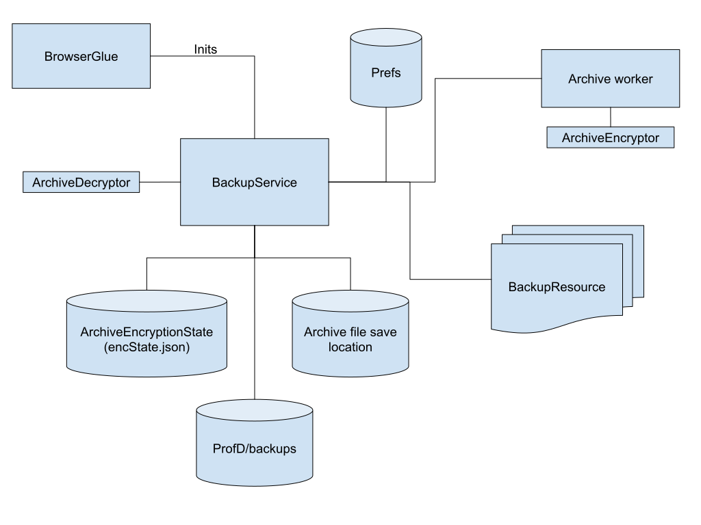

High-level architecture
=======================

The ``BackupService`` module is architected in a way to make testing its
individual components relatively easy with unit tests.

The main entry point exists in a module called
``BackupService.sys.mjs``, which is `invoked and initialized via in the
BrowserGlue idle tasks
list <https://searchfox.org/mozilla-central/rev/97feebcab27f1a92e70ceacaa77211e9eaba0e6e/browser/components/BrowserGlue.sys.mjs#2449-2470>`__

The ``BackupService`` manages two high-level operations: creation of
backups, and recovery from such backups.

BackupService diagram
---------------------

This is a non-exhaustive architecture diagram that attempts to
illustrate the relationships between various high-level components
surrounding ``BackupService``.

This set of components surrounding ``BackupService`` is fairly self
contained, and there are very few points outside of
``browser/components/backup`` where the ``BackupService`` or any of
these other components are used. The exceptions here being
``BrowserGlue`` to kick off initialization, and the preferences UI which
embeds wigetry to control the ``BackupService``.

Creating backups
----------------

``BackupService`` initialization takes the opportunity to collect some
Telemetry, and after sets up a scheduling mechanism to generate backups
if the user has configured it to.

The process of creating a backup has three stages:

1. Copying the resources into a temporary staging folder
2. Creating the archive file
3. Cleanup

Copying the resources into a temporary staging folder
~~~~~~~~~~~~~~~~~~~~~~~~~~~~~~~~~~~~~~~~~~~~~~~~~~~~~

The ``BackupService`` create (or overwrite if pre-existing) a folder at
``ProfD/backups/staging``. For each ``BackupResource``, a folder will be
created under that ``staging`` folder. The path to that folder will then
be passed to each ``BackupResource``, which will then be responsible for
safely copying the datastores that the ``BackupResource`` represents
into the new folder. ``BackupResource``\ s may also perform
pre-processing on these copies before they’re written.

Note: Some ``BackupResource`` subclasses only have ``backup`` called if
the user has configured backups to be encrypted. This is because we want
to do our best to protect a backup file that may be sent over untrusted
channels - for example, uploaded over the network to Dropbox or Google
Drive, or even sent through email. The most sensitive data (passwords,
cookies and payment methods) are only included in the backup when
encryption is enabled.

For JSON or binary files that are atomically written to, simple file
copy operations are used by each ``BackupResource``. For SQLite
databases, the `SQLite Online Backup
API <https://www.sqlite.org/backup.html>`__ is used to ensure a complete
working copy is made. This API is made available through
``Sqlite.sys.mjs``.

A ``backup-manifest.json`` file is also included in the ``staging``
folder, describing the resources stored, and other metadata about the
created backup.

Creating the single-file archive
~~~~~~~~~~~~~~~~~~~~~~~~~~~~~~~~

Once all ``BackupResource``\ s have had a chance to make their copies,
the contents of the ``staging`` folder is compressed and packaged into a
single-file archive. This archive may be encrypted if the user has
configured backups to include sensitive data.

Cleaning up
~~~~~~~~~~~

Once the single-file archive has been created, it is moved into the
user-configured location, overwriting any pre-existing backup file for
the particular profile.

Having done that, the ``backups/staging`` folder is then deleted.

Recovering from backups
-----------------------

The process of recovering from a backup has three stages:

1. Extraction and decompression from the single-file archive
2. Recovering into a newly created profile folder
3. Post-recovery actions

Extraction
~~~~~~~~~~

The first step is to extract (and if encrypted, to decrypt) the backed
up data from the single-file archive. The end-result of this step is a
new folder being created under ``ProfD/backups/recovery`` that has the
backup contents decompressed into it. The ``recovery`` folder is an
exact mirror of the ``staging`` folder for when the backup was created.

Recovering into a newly created profile folder
~~~~~~~~~~~~~~~~~~~~~~~~~~~~~~~~~~~~~~~~~~~~~~

The ``BackupService`` will create a new user profile, and then for each
resource listed in ``backup-manifest.json``, the associated
``BackupResource`` will be instantiated and passed the path to the
subfolder under ``recovery`` associated with the ``resource``. The
``BackupResource`` is then responsible for copying the datastores from
that folder into the newly created profile folder.

Each ``BackupResource``, while recovering, may emit some information
that gets written to a ``post-recovery.json`` file that is also written
into the profile folder.

Once this completes, the newly created profile is launched and the
current one shut down.

Post-recovery
~~~~~~~~~~~~~

``BackupService`` initialization also checks to see if the launched
profile was just recovered from a backup, in which case, post-recovery
actions may occur - for example, datastore updates that can only occur
when the recovered profile is running.

This is done by checking for the ``post-recovery.json`` file in the
current profile directory. If this is found, then each
``BackupResource`` is instantiated and passed the post-recovery data
that was emitted and stored in the JSON file during recovery.

This is useful when there are certain actions that can only be performed
when the recovered profile is running. For example, we can only insert
data into IndexedDB databases within an application that is attached to
those databases.
