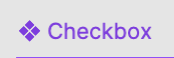
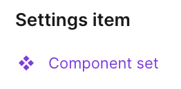
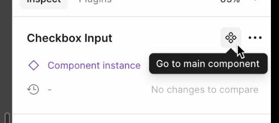

# Figma Code Connect

[Code Connect](https://www.figma.com/code-connect-docs/) is a bridge between your codebase and Figma’s Dev Mode, connecting components in your repositories directly to components in your design files.
We use Code Connect to generate recommended code snippets for our Figma components to improve the developer experience when translating designs to code.

## How to set up Code Connect

First, you'll need to install [the Code Connect command line tool](https://www.figma.com/code-connect-docs/quickstart-guide/#install-the-code-connect-command-line-tool) via `npm`:

`npm install --global @figma/code-connect@latest`

Second, you'll either need to add your [Figma personal access token](https://help.figma.com/hc/en-us/articles/8085703771159-Manage-personal-access-tokens) to your terminal environment:

`export FIGMA_ACCESS_TOKEN='your-generated-access-token'`

You could also add your personal access token via `.bashrc`, `.zshrc`, or other appropriate file based on your shell environment.

## How to use Code Connect

### Finding a Figma component to generate the initial Code Connect file

After installing and setting your `FIGMA_ACCESS_TOKEN` in your terminal, you will need to navigate to our Figma library to find a component that needs a Code Connect config file.

You can find a potential component through various ways:

1. Searching through the open dependent bugs on [Bug 1955395 - [meta] Figma Code Connect](https://bugzilla.mozilla.org/show_bug.cgi?id=1955395).
2. Checking the "Explore component behavior" in Figma and seeing if there no code snippet in the "Component playground".

**Note:** not all Figma components will need a code connect config.
For example, the "Label" component is something that exists as a standalone item in Figma but is set up through a containing component in code.
Our [MozBaseInputElement](https://searchfox.org/mozilla-central/rev/ced8457641a062908760d480275f76ccc4d496d1/toolkit/content/widgets/lit-utils.mjs#392-400) shows this pattern if you're looking for a concrete example.

Once you are aware of the Figma component you want to work on, you'll need to navigate to Figma and find the base Figma component.
It should have an icon of a diamond made of four smaller diamonds.
When you select this component, it likely will say **Component set** in the sidebar.




If you have found an instance of a component then there should be an option indicated by either a diamond with four smaller diamonds or a diamond with an arrow pointing out from the diamond.
This icon button is used to go to the main component, and will be labelled "Go to main component" once you hover on the icon button.
Use this "Go to main component" button to check if there is a component set higher up in the hierarchy.
Once you've got the main component set, then you can copy a link to the component and move to generating the Code Connect config in your terminal.




### Generating the initial Code Connect file for a Figma component

After finding the main component set in the previous step and copying the link to the main component, navigate to your Firefox repo in your terminal and then navigate to `toolkit/content/widgets`.
To simplify development, we will create the initial config file in `toolkit/content/widgets` by running the following command (please note the single quotes are needed to correctly parse the URL!):

`npx figma connect create '<main component set link>'`

For example, this command would look something like `npx figma connect create 'https://www.figma.com/design/[...]?node-id=1-255&m=dev'` where the full URL is the GUID for your design document.
This command will work regardless if you copied the link in Dev Mode or not.

If the Code Connect tool was able to find a component in that copied URL, you will receive the following output in your terminal:

```
Fetching component information from Figma...
Parsing response
Generating Code Connect files...
Code Connect files generated successfully:
<firefox-repo-path>\<component-name>.figma.ts
```

If the Code Connect tool was not able to find a component, it will throw an error and notify you in your terminal output.
The most common reason for this error is the particular node or layer you used for the linked URL is not actually a component but a wrapper for one or more components.
Try navigating a layer above or below the node you used and see if you are able to generate a Code Connect config file using one of those other nodes.

### Modifying the generated config file

While generating the file is a good start, you will need to move it, rename it, and modify it.
You should move this generated file to the component specific folder and rename it to `<component-name>.figma.ts`.
The goal of this config is to create a mapping between what properties the Lit component takes and what properties are defined in Figma.
The `props` object will be a map from the Lit component’s properties to the Figma component’s properties.

#### When the types match

The value of the `figma[type](propertyName)` "code" will be the value as you expect from figma.
So if it is the “checked” boolean in Figma, that value will be set to true when the instance in Figma has it set to true.
```javascript
checked: figma.boolean("Checked")
```

#### When the types are different
You can work around a type difference by providing an object to the `figma[type]` call, this will be used to match the value that the Figma property is set to and map it to a value for the Lit property.
```javascript
// Figma State=IsChecked will set checked:true
checked: figma.Enum("State", {
  IsChecked: true,
}),
// Figma "Show icon"=true will set iconSrc:"chrome://example.svg"
iconSrc: figma.boolean("Show icon", {
  true: "chrome://example.svg",
  false: undefined,
}),
```

For example, we need to work around the Figma "State" enumeration to ensure that [moz-checkbox](https://searchfox.org/mozilla-central/source/toolkit/content/widgets/moz-checkbox/moz-checkbox.figma.ts) is disabled correctly in the generated code snippet:

```javascript
// Figma State=Disabled will set disabled:true on the generated code snippet
disabled: figma.enum("State", { Disabled: true })
```

#### Creating the example template
This example template will become the code snippet that is shown in Figma.
It will basically be the same as the Lit code but without the optional chaining (`?.`) operator.

```javascript
example: props => html`
  <moz-checkbox
    checked=${props.checked}
    disabled=${props.disabled}
    iconsrc=${props.iconSrc}
></moz-checkbox>`
```

There is [other prior art available on searchfox](https://searchfox.org/mozilla-central/search?q=figma.ts&path=&case=false&regexp=false) when you search for figma.ts files that will assist you.

### Publishing the modified config file

After making your changes to the generated file, you can verify if your changes are valid by running:
`npx figma connect publish --dry-run`

If this check passes, you can verify your changes on Figma by publishing the file by navigating to the directory that it is in and running `npx figma connect publish`.
After doing this, navigate to the node that you copied the link for earlier in this process (or check the modified config file as this will have that same URL).
Under the "Inspect" sidebar, there should now be a "Recommend code" section with the snippet you created under the "example" key in the config file.

If this generated snippet does not appear to be correct, you can undo the change on Figma by utilizing the following command when you are in the same directory as the config file you are working on:

`npx figma connect unpublish`

Afterwards, commit and submit the file via `moz-phab` as you would any other bug.

## Code Connect issues/pitfalls/scenarios

### Mapping Figma props back to Lit props
You may encounter cases where in Figma you can toggle some configuration of a component.
For example, given [the "Checkbox with label" component](https://www.figma.com/design/3WoKOSGtaSjhUHKldHCXbc/Desktop-Components-3?node-id=32-996&m=dev), we can toggle a description, a support link, and an icon.
When activating the "Show description" and "Show support link" toggles, we get two new editable text fields, "Description" and "Support link".
To ensure the generated code snippet shows the correct value for these fields, we have to map a Figma boolean to return a string when the boolean is true:

```javascript
props: {
  description: figma.boolean("Show description", {
    true: figma.string("Description"),
  }),
  supportPage: figma.boolean("Show support link", {
    true: "sumo-slug",
  }),
}
```

In the "Description" case, we use `figma.string("Description")` so that the generated snippet will show the current value in the "Description" text field.
We don't do this for the "Support link" case though, since the way to get the correct generated support link element is by passing a SUMO slug to `<moz-checkbox>`.

### Working with nested props and nested components
You'll notice that the actual moz-checkbox config file has a relatively large `props` object with two additional props objects called `labelProps` and `checkboxProps`.
This is due to how the component is set up in Figma as the main component is a wrapper called ["Checkbox with label"](https://www.figma.com/design/3WoKOSGtaSjhUHKldHCXbc/Desktop-Components-3?node-id=32-996&m=dev).
This component consists of two components, "Checkbox" and "Label", so we'll use these component names for our nested props:

```javascript
props: {
  // labelProps is intentionally omitted for simplicity
  labelProps: figma.nestedProps("Label", ...),
  checkboxProps: figma.nestedProps("Checkbox", ...),
}
```

This allows us to take our previously defined "Checkbox" props and reference them through `checkboxProps` which will be required for the updated example template:

```javascript
props: {
    // labelProps is intentionally omitted for simplicity
  labelProps: figma.nestedProps("Label", ...),
  checkboxProps: figma.nestedProps("Checkbox", {
    checked: figma.boolean("Checked"),
    disabled: figma.enum("State", { Disabled: true }),
  }),
}
```

Once we add these nested references to our example template, then changing these properties in Figma will cause the generated code snippet to be updated accordingly:

```javascript
props: {
    // labelProps is intentionally omitted for simplicity
  labelProps: figma.nestedProps("Label", ...),
  checkboxProps: figma.nestedProps("Checkbox", {
    checked: figma.boolean("Checked"),
    disabled: figma.enum("State", { Disabled: true }),
  }),
  example: props => html`
  <moz-checkbox
    checked=${props.checkboxProps.checked}
    disabled=${props.checkboxProps.disabled}
></moz-checkbox>`
}
```

### What if something in Figma doesn't map back to anything in the implemented component?

Sometimes that's okay!
Some props will not map back to code and may be there to make using Figma easier.
For example, many of the options under the "State" select for a component do not get mapped to code.
Using the "Checkbox with label" Figma component as an example again, there are various options for State:
- Default
- Hover
- Active
- Focus
- Disabled

There's nothing we have to pass to `<moz-checkbox>` for it to appear in a "Default" state, so we do not need to map this.
"Hover", "Active", and "Focus" are all CSS pseudo-classes that are handled by the code implementation, we don't have to pass any additional props for these states to behave as expected.
This leaves us with "Disabled" which is something that can be controlled through a property/attribute, therefore we want to make sure this attribute appears in the generated snippet when a Figma user selects "Disabled" in the dropdown.

```javascript
props: {
  disabled: figma.enum("State", { Disabled: true }),
}
```

Other times, this could be a sign that there's a deviation in the design or the implemented component.
Maybe it's a feature that hasn't been implemented yet, and so we don't want to show any code snippets when that feature is enabled in Figma.
It could be something that was missed when previously creating the Code Connect config for a particular component, there could be a variety of reasons.
It may be worth reaching out to design to make sure the implemented component and the design component are not deviating from each other.
