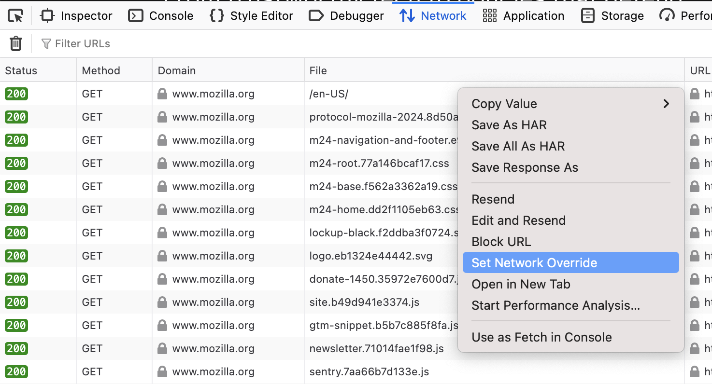
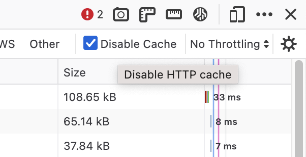
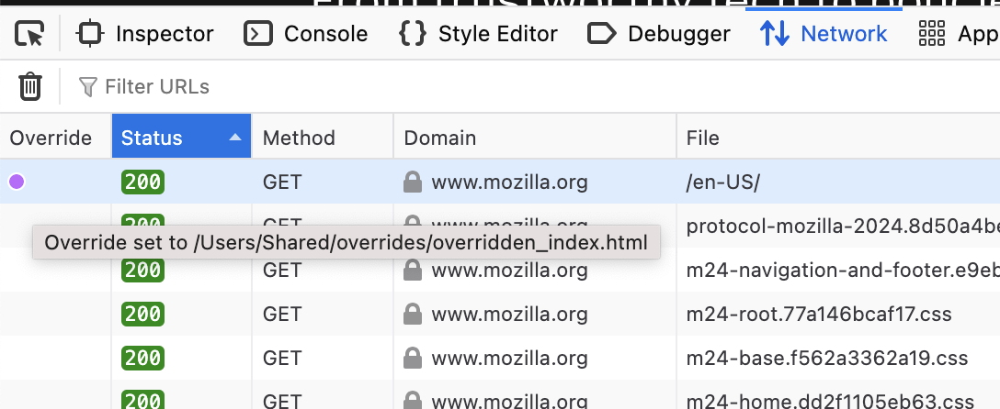
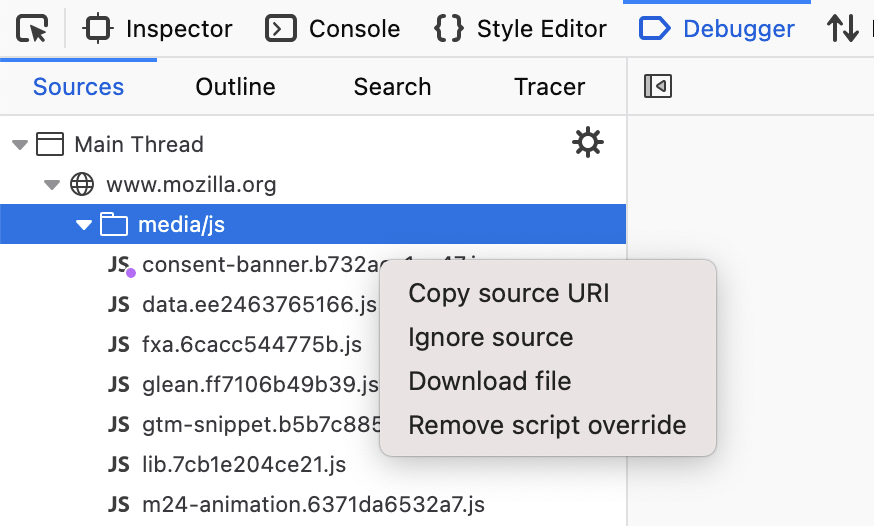

=================
Network overrides
=================

Since Firefox 137, the DevTools :doc:`Network Monitor <../index>` can be used to override the response of individual requests. This can be useful for mocking responses or quickly testing changes on live websites.

Set Network Overrides in the Network Monitor
********************************************

To use this feature, open the Network Monitor and trigger the request you want to override.

Find the request in the request list of the Network Monitor and right-click on it. There should be a menu item called "Set Network Override". Clicking on this menu item should trigger a file prompt. This file prompt will save the current response to a local file.

Pick a convenient location to save your override and confirm the file prompt. From now on, every time the tab hits the URL of the overridden request, it will read the response from the local file selected or created earlier, instead of reaching the network.

It is recommended to disable the Network cache when using Network Overrides. This ensures the browser does not reuse a cached copy of the response instead of the local file.

This feature can be used with any type of request (e.g., HTML, JS, CSS, JSON). Note that the override is only active for a single tab, and will not be persisted after the DevTools toolbox is closed. Multiple requests can be overridden independently

Override column in the Network Monitor
**************************************

After adding a Network Override, a new "Override" column should now be displayed on the left of the request list. This column is automatically visible as soon as an override is set. All requests for which an override has been defined will be indicated with an icon in this "Override" column. Hovering on the icon will reveal the path to the local file used for the override.

If all overrides are removed, the column will be automatically hidden. To remove an override, open the context menu for an overridden request and select "Remove Network Override"

Updating script overrides in the Debugger
*****************************************

You may already be familiar with the "Add Script Override" feature in the DevTools Debugger. This feature actually uses the same underlying mechanism as Network Overrides.. Any Script Override added in the Debugger will show up as a Network Override in the Network Monitor, and vice-versa.

While the underlying feature is identical, the Debugger can only set and remove network overrides for scripts or HTML documents containing an inline script. In order to override any other type of resource, the Network Monitor should be used.
