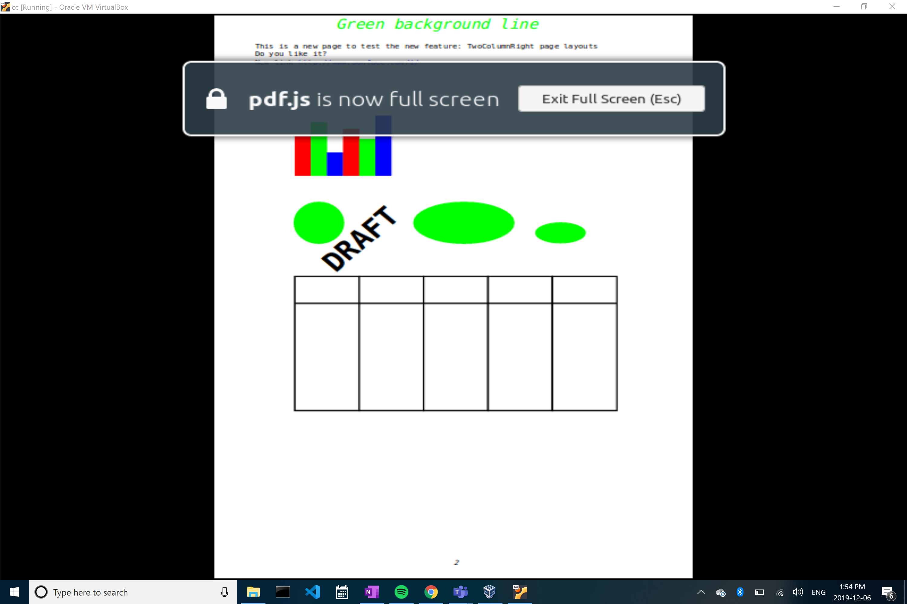

# CSC302 A3
[Bug 1570477 - Register as a webp handler](https://bugzilla.mozilla.org/show_bug.cgi?id=1570477)  

[My patch](https://github.com/bxlt/gecko-dev/blob/a3/doc/1570477.patch)

[My pull request](https://github.com/bxlt/gecko-dev/pull/1) 

## Diagnosis
From Google Developer Guide: [https://developers.google.com/speed/webp](https://developers.google.com/speed/webp), A WEBP file is an image saved in the WebP raster image format developed by Google for web graphics. Google Chrome is registered as the default viewer of webp files in Windows. Firefox and Firefox Nightly can open webp file by drag and drop or right click -> open with. 

The issue describes in the bug report is that starting with a PC that has no webp viewer installed (i.e. no Google Chrome), if user install Firefox then no windows file associations are created to let user double-click open a .webp file. 

There is no risk in making changes since clear comments are written in the related file and I only need to add several lines to corrected sections.

## Solution
For this specific bug, I need to identify several sections that are lists of file extensions that Firefox install (and uninstall), and .webp just needs to be added to those lists. There are two sections in the ```shared.nsh```, and also one when we uninstall the associations in ```uninstaller.nsi```. To fix this bug, I followed the patterns that are already there to add lines for .webp.

## Testing Procedure
Automatic testing is done by making ```./mach build``` build correctly and run ```./mach test all```. 
Manual testing is runing ```./mach package``` and find the installer in ```obj-x86_64-pc-mingw32/dist/install/sea/```. To test the installer, user must be on a Windows machine.
Before: Firefox Nightly and Chrome are both installed. Chrome opens .webp automatically by default:

After: Double click webp file, it shows you can select Firefox Nightly.


