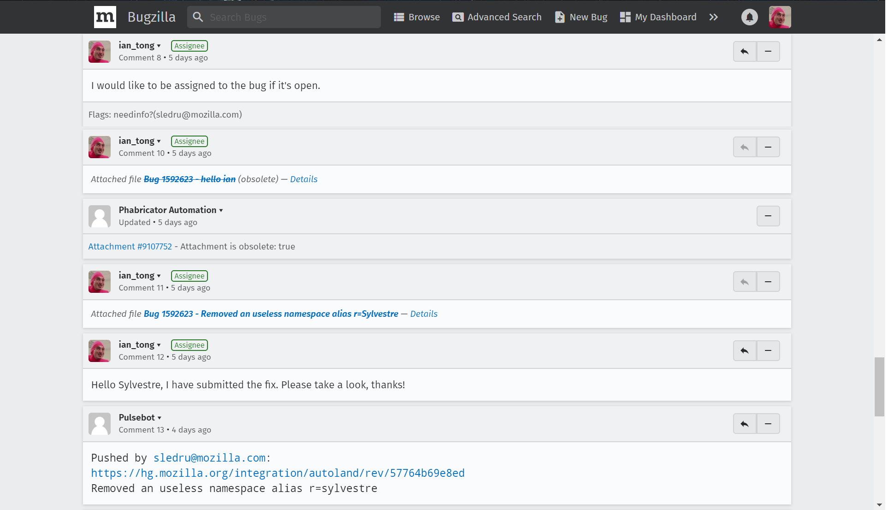
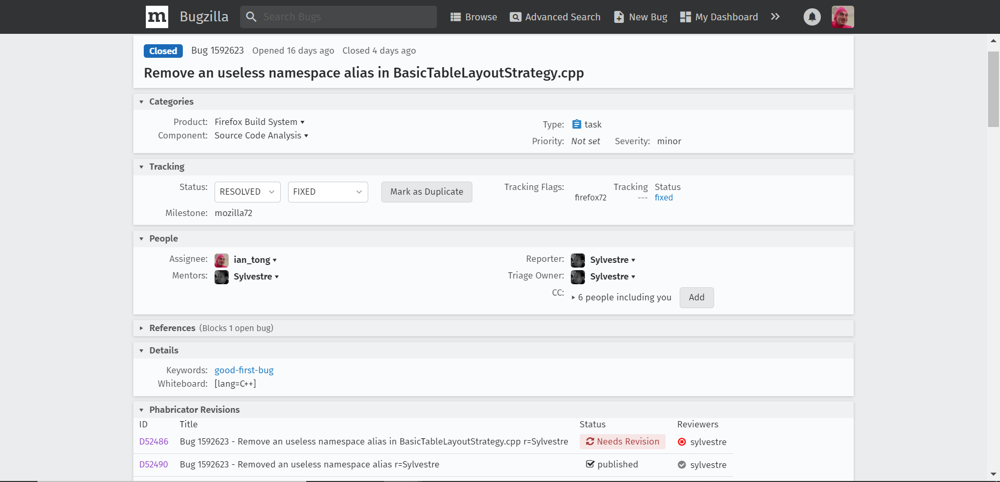
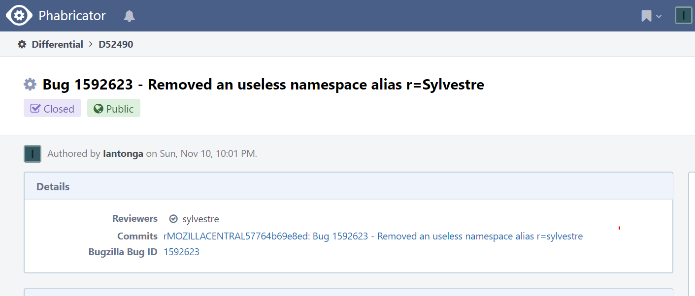

## 1. Bug URL:
https://bugzilla.mozilla.org/show_bug.cgi?id=1592623

## 2. Bug Diagnosis
The bug is an unused namespace alias declaration 'css' in: mozilla-central/layout/tables/BasicTableLayoutStrategy.cpp. 
The benifit of fixing this bug would be to maintain concise coding style and improve readability. The only risk of this fix maybe that a 
developer left the decleration there for a feature to be implemented in the future. However this is not a real concern because if and when 
that new feature is being implemented the alias could be declared again.

## 3. Proposed solution
The fix is to simply delete the unused line, make sure the alias is not used anywhere in the file and ensure corrent blank lines 
before and after. 

## 4.Test plan
The testing procedure is to manually check if the line has been removed, and then run mach build the mach run to ensure codebase correctness.

## 5. Screenshots

Fig.1 The comments on Bugzilla showing me claiming the bug and requesting information from the owner and subsequently submitting a fix then requesting review. 

Fig.2 Shows that I was assigned to the bug

Fig.3 The revision page on phabricator (https://phabricator.services.mozilla.com/D52490) showing that my patch has been reviewed and approved, along with the bug closed.
