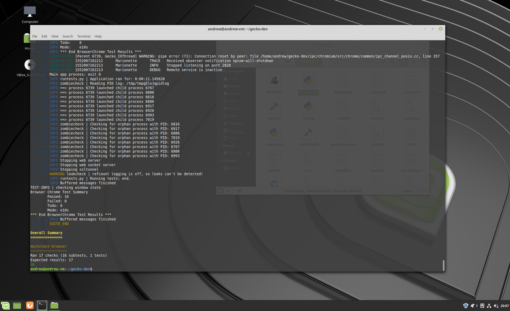

# Assignment 3

Bugzilla: https://bugzilla.mozilla.org/show_bug.cgi?id=1531437

#### Diagnosis
The bug specifically deals with removing an old compatibility workaround used to check css property names in the Firefox devtool inspector. Starting with Firefox version 61 (FF61), `StyleRuleActor` provides an accessor that indicates whether or not the given css property name was valid. At the time of FF61, backwards compatibility was maintained with versions <FF60 that did not have such an accessor by explcitly checking for the existing of the accessor to determine behaviour.

As the current version of Firefox in development is FF67, it has been decided to remove the backwards compability as it is now obsolete.

##### Benefits
The main benefit is code cleanliness and proper maintenance, so to say - as new features are added, backwards compatibility needs to be maintained for users that might not have necessarily updated yet. However, as new versions are continually released, older workarounds should be removed in the interest of code cleanup and clarity (wherein such workarounds are obsolete, and might instead obfuscate intended behaviour due to the presence of workarounds).

##### Risks
As mentioned earlier, users that are still using outdated versions of Firefox (<FF61) might incorrectly identify invalid/valid css property names made with newer versions of Firefox (>=FF61) until they update. Ideally, this shouldn't be possible as the workaround was added to account for exactly this situation, but it is always possible for unintended side effects to be seen.

##### Solution Proposal
First I would make sure that my local fork and branch are updated. From there, I will locate the correct location of the code/comment and make the changes according to my mentor's advice. Afterwards, I will test according to the steps I described in the testing documents. From there, I will follow the Mozilla practices for creating a patch and submitting the patch for review.

#### Testing Document
In a perfect world, there are no visible changes that can be screenshotted directly to indicate that the fix worked. According to note 1, my fix is more "under the hood" than a visible change. In my case, I followed my mentor's advice and ran the tests that check for name correctness using the command `./mach mochitest -f browser devtools/client/inspector/rules/test/browser_rules_authored.js`. The output of the tests are attached below. I also followed their advice on the bug ticket and tested invalid names (that would fail the test) and indeed they did.

#### Testing Screenshot

