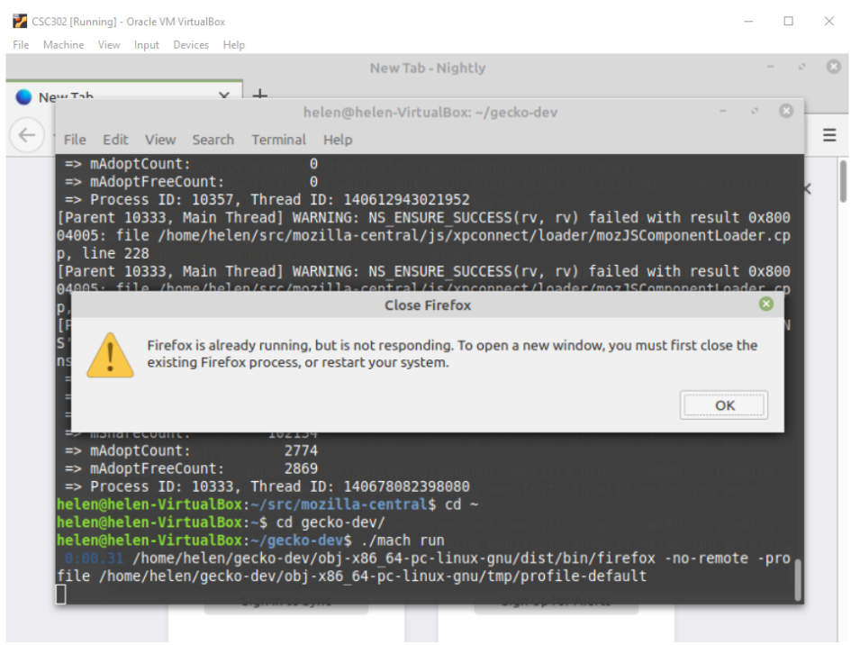
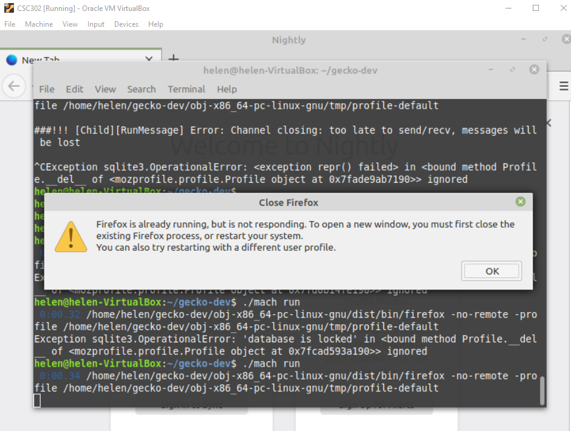

# CSC302-2020 A3 Mozilla BUG#408513 
### https://bugzilla.mozilla.org/show_bug.cgi?id=408513

## Diagnosis
When starting two firefox instances with the same user account (by running ./mach run on two separate terminals), a message box will pop up stating the program is already running and will prompt the user to close the current process. However, Firefox is in fact capable of running on multiple instances but just with an additional tweek to start as a new profile (referring to post #408513). 

In order to eliminate further confusions caused by the misleading message box, the displaying string needs to be changed with an additional line addressing this issue. Solving this bug will help in future debugging processes by addressing the specific problem of opening firefox with multiple instances, along providing a suggested solution to the instantly through the message box. Since this bug only involves changing the string of the message display box, there will be no risk that affects functionality of Firefox. However, there is a possibility that the newly added string may seem confusing for non-advanced users since they are out of context of this specific issue.

## Solution
Based on post #408513, this bug can be fixed by creating a new message string with an additional line “You can also try starting Firefox with a different user profile.”  The locations where this message is referenced and defined are:
mozilla-central/source/toolkit/xre/nsAppRunner.cpp  (line 1735)
mozilla-central/source/toolkit/locales/en-US/chrome/mozapps/profile/profileSelection.properties (line 10)
The current variable name used is “restartMessageNoUnlocker”, as the solution I will keep this variable name and only modify the string value to have the additional line to prevent potential issues caused by missing variable.

## Testing
Since the message box is invoked on starting the Firefox instance using ./mach run with two terminals, the only testing process is to run the program and manually inspect the pop-up message contents.See attached two images on the before and after display of the message box.

