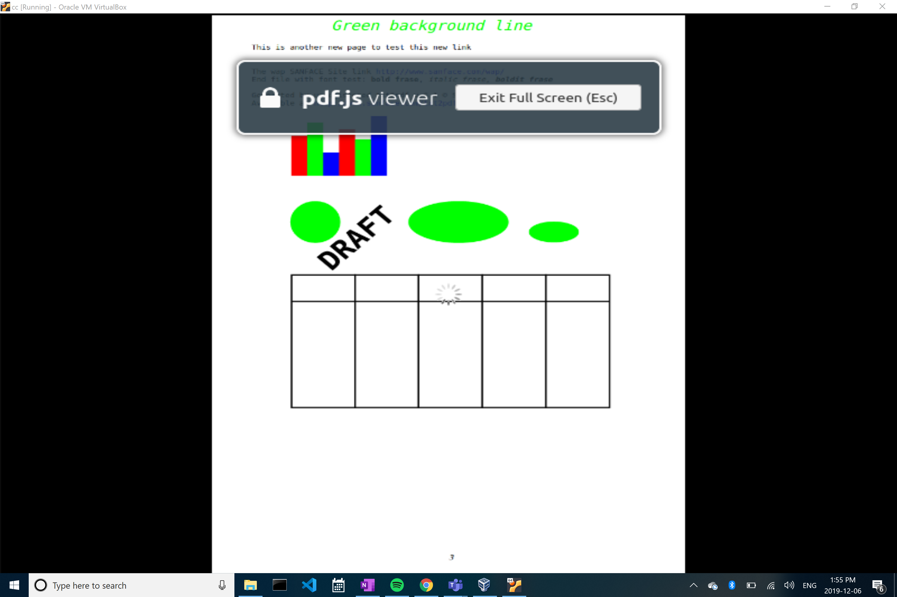

_Bug URL:_ https://bugzilla.mozilla.org/show_bug.cgi?id=1225162

PR URL:
_PR URL:_ 

Patch File URL:
_Patch File URL:_ https://github.com/chr-chiu/gecko-dev/blob/master/doc/1225162.patch

 **Bug Diagnosis:** 
 
 this bug occurs when you open a pdf on the firefox browser, then press full screen or presentation mode. A pop up message with say "PDF is now full screen" which is not appropriate or the best option.
 
 **Before fix**
 

**Bug Solution:**
I navigated to the portion of the code that had the popup message when putting anything into fullscreen mode. I found that to be on line 105 of browser.dtd. I then changed the message from the original to a more appropriate one.

_After my solution:_

**Testing:**

To test my bug solution I reproduced the bug posted and checked for desired outcome. 
 
The steps are:
- Run `'./mach build'` to verify that the project builds successfully.
- Run `'./mach run'` to verify all the automated tests are passing.
- Go to 'https://www.sanface.com/pdf/test.pdf#page=2&zoom=auto,0,829' or any url in which a pdf is displayed.
- Click the full screen button
- watch for the popup message that is the bug

