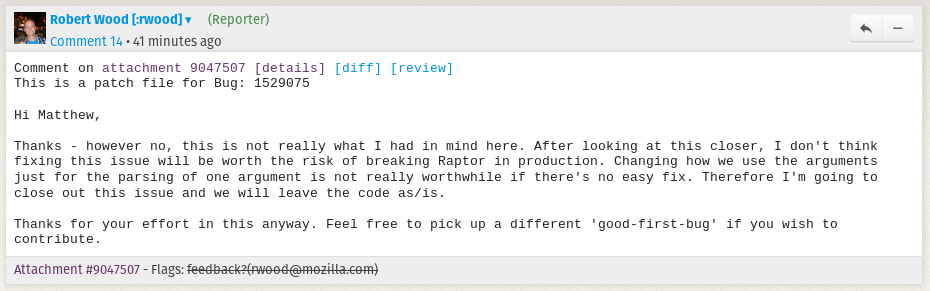

# Bugzilla: [Bug 1529075](https://bugzilla.mozilla.org/show_bug.cgi?id=1529075)

> Use argparse to get local command line opts in Raptor’s mozharness script

When raptor is initiated locally, the command line args, which are passed in from `./mach` inside `raptor_cmd_line_args` can be in two formats depending on how the user entered them, i.e. “–app=geckoview” or separate as “app geckoview” so both forms need to be accommodated accordingly.

## Diagnosis

Currently the way Raptor retrieves command line options when running locally via mach (mozharness) is not the cleanest [1]. This should be improved by using argparse instead.

```python
if self.run_local: # Running locally via mach
    # raptor initiated locally, get app from command line args
    # which are passed in from mach inside 'raptor_cmd_line_args'
    # cmd line args can be in two formats depending on how user entered them
    # i.e. "--app=geckoview" or separate as "--app", "geckoview" so we have to
    # check each cmd line arg individually
    self.app = "firefox"
    if 'raptor_cmd_line_args' in self.config: # [1] Not the cleanest
        for app in ['chrome', 'geckoview', 'fennec']:
            for next_arg in self.config['raptor_cmd_line_args']:
                if app in next_arg:
                    self.app = app
                    break
```

### Benefits

> `argparse` - Parser for command-line options, arguments and sub-commands

Allows out of the box functionality for the following:

- Adding new arguments
- Apply input validation without having to write lots of code.
- Display the appropriate messages when the args supplied by the user is incorrect.

### Risks

The arguments that need to be accommodated are hard coded in three other files. This means that consistency must be kept among everywhere that arguments that want to be apart of the command line options for raptor.
- `config_options[]` - raptor.py
- `testing_config_options[]` - testbase.py
- `config_coverage_config_options[]` - codecoverage.py

## Solution

The requirement of accommodating both ways that a user might pass in arguments is taken care of by using argparse.

Since each argument has a different set of configurations, I created a custom statement when adding each argument and used the exec command to parse them

The final custom statement needed to have certain things changed to accommodate how argparse wants their arguments added.

- When type is specified, it can’t be specified as a string.
- When type is specified, it has to either be a str, an int, or a bool, not an enum.
- For arguments that have variable length, the valid argparse action is append, not extend.

### UPDATE 20190308

After presenting my solution to the reporter for the bug, I was informed that fixing this issue would be worth the risk of breaking Raptor in production.



## Testing

- Testing was done by running raptor tests locally and passing in arguments both ways mentioned by the requirements. 
- The parsed raptor command line arguments were printed out and verified for no missing pieces.