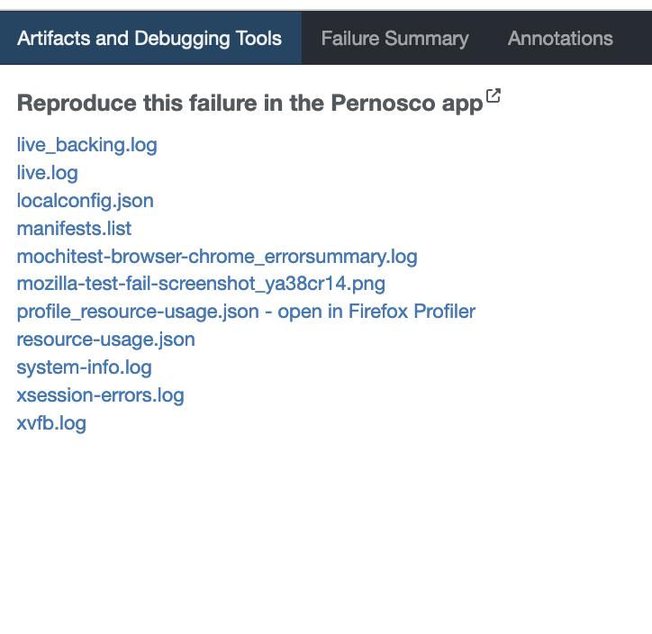
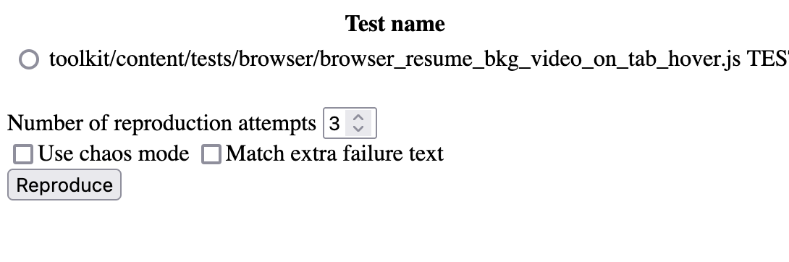

Debugging Firefox with Pernosco
===============================

This page is intended to help Firefox/Gecko developers get started using `Pernosco <https://pernos.co/>`_
to debug Firefox.

Mozilla employees have a paid subscription to Pernosco, and are encouraged to use it.
Contributors can use Pernosco as well. `A free account <https://pernos.co/pricing/>`_
comes with 5 uploads to see if it is suitable for your workflow.

Prerequisites
-------------

- You need the ability to produce an :code:`rr` trace. See :doc:`debugging_firefox_with_rr`
- Employees, you can also generate traces for Pernosco for some CI job failures via
  Treeherder.

Workflow
--------

At a high level, working with Pernosco consists of recording a trace then uploading
the trace for processing.

Install your Pernosco configuration
~~~~~~~~~~~~~~~~~~~~~~~~~~~~~~~~~~~

If you are using your own Pernoso account, follow the instructions
`here <https://pernos.co/account>`_ to install your credentials.

Mozilla employees, see the `Pernosco install and configuration doc
<https://docs.google.com/document/d/1cb-mkNyJYMudpS0a-R6zxy0kOMIRUSKrxxL-E9zFGKE/edit>`_
for credentials.

In general, you will want:

 * Your email in :code:`~/.config/pernosco/user`
 * Your group in :code:`~/.config/pernosco/group`
 * Your key in :code:`~/.config/pernosco/user_secret_key`

Gather a Local Trace
~~~~~~~~~~~~~~~~~~~~

In general, to gather a trace follow the instruction for recording :code:`rr` traces
in :doc:`debugging_firefox_with_rr`. However, to gather a local rr trace that’s
compatible with Pernosco you need to disable some incompatible CPU features (currently
only AVX-512)

On an Intel machine, you can disable this at the command line. To simplify things a
shell script :code:`pernosco-record` can be created like so,

.. code:: bash

    #!/bin/bash

    rr record --disable-avx-512 "$@"

replacing plain :code:`rr` in command lines (:code:`mach --debugger pernosco-record`)

On AMD Zen Machines, you can disable AVX-512 and 5 level page tables at boot.

On a Debian derived distro this involves editing :code:`/etc/default/grub` and
adding :code:`clearcpuid=304,no5lvl` to :code:`GRUB_CMDLINE_LINUX_DEFAULT`, then
running :code:`sudo update-grub` after.

Upload the trace
~~~~~~~~~~~~~~~~

Find the trace you’re interested in :code:`~/.local/share/rr/<trace>`, and call :code:`pernosco-submit`

.. code:: bash

   pernosco-submit upload ~/.local/share/rr/<trace> PATH_TO_CENTRAL --title "Name Of Trace"

where :code:`PATH TO CENTRAL` is the path to the source of your build, checked out
to the revision matching the build.

The last trace recorded is always symlinked, so you can use :code:`~/.local/share/rr/latest-trace` too.

Wait for email
~~~~~~~~~~~~~~

After the trace is processed, you'll get an email with a link to your trace. Good
hunting!

Treeherder Workflow
-------------------

You can also try to get traces generated via the Treeherder interface. On a failing
test that is eligible, in "Artifacts and Debugging Tools", you'll see a link to

This link brings you to the self-service reproducer:

Select a test and a count, and whether or not chaos-mode should be used, then click
reproduce. At this point there is a **long** wait; the page will notify you when
reproduction has started with an :code:`alert` dialog.
