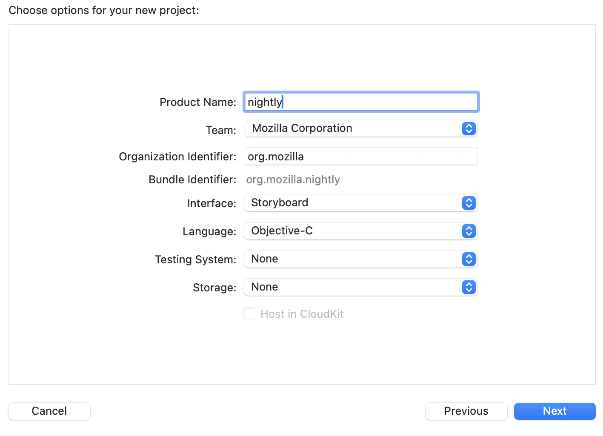
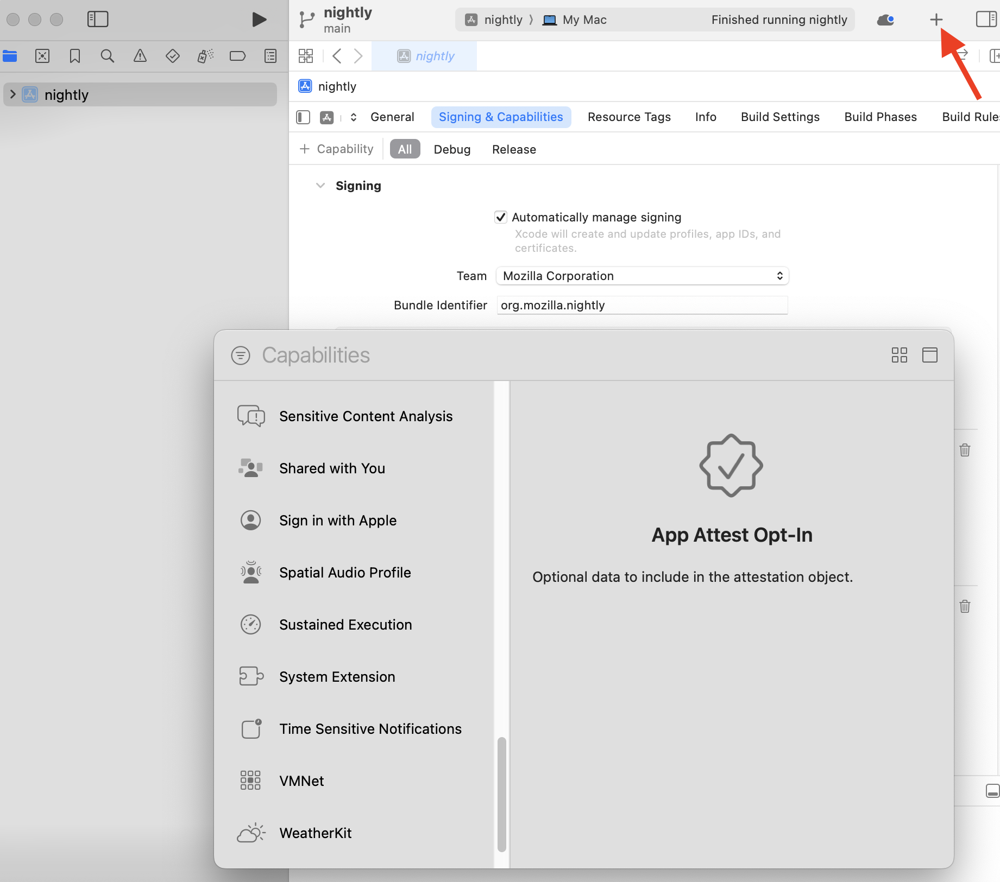
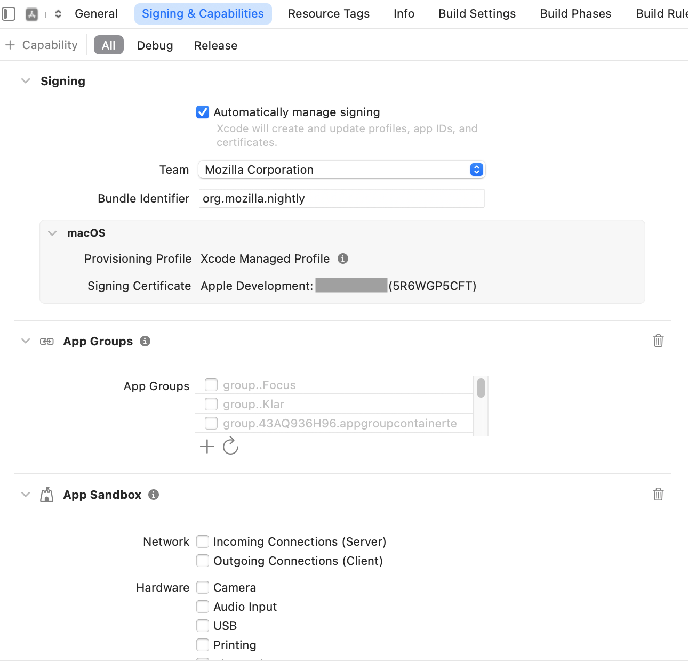

Configure Development Certificate
=============================================================

To locally test macOS builds that are signed like production builds and can use
restricted entitlements, you need a valid development signing certificate and
provisioning profile from Mozilla’s Apple Developer account.

Before you begin, make sure your Apple Developer account has been added to
Mozilla’s Apple Developer team. If you don’t have access to Mozilla’s Apple
Developer account, you can `request access through Bugzilla
<https://bugzilla.mozilla.org/enter_bug.cgi?product=App%20Stores&component=App%20Store%20Access>`__.
You'll also need to have Xcode installed and be signed in to your Apple ID
within Xcode.

To obtain the necessary certificate and provisioning profile, we’ll create a
simple Xcode project. This project doesn’t need to be functional, its purpose
is only to trigger Xcode into automatically creating and downloading the
required signing certificate and provisioning profile. Once set up correctly,
Xcode will add the development certificate to your local keychain (visible in
Keychain Access) and download the provisioning profile for you.

Step 1: Set Up a macOS App Project in Xcode
-------------------------------------------

Begin by launching Xcode and creating a new project. Choose ``App`` under the
macOS tab and click ``Next``. On the next screen, fill out the form by setting
the Product Name to ``nightly``, and under Team, select Mozilla Corporation.
If it doesn’t appear, make sure you're logged into your Apple ID, select
``Add Account``, and choose Mozilla Corporation from the available teams.
For the Organization Identifier, enter ``org.mozilla``. Leave the default
options for Interface and Language (Storyboard and Objective-C, respectively).
After clicking ``Next``, choose a location for your project and create it.

Step 2: Enable Automatic Signing
--------------------------------

Once your project is set up, select it in the left sidebar of Xcode. Then go to
the ``Signing & Capabilities`` tab.

Ensure that ``Automatically manage signing`` is checked, and verify that the
Team is set to Mozilla Corporation. Then, in the ``Signing & Capabilities``
tab, click the ``+`` Capability button and add both
``Web Browser Public Key Credential Requests`` and ``App Groups``.
Adding these capabilities prompts Xcode to download a development certificate,
private key (which you can view in Keychain Access), and a provisioning profile
that includes the necessary entitlements.

After adding the required capabilities, the ``Signing & Capabilities`` screen
should update to show a signing certificate under the macOS section, indicating
that Xcode has downloaded the provisioning profile.

To verify that the certificate has been installed correctly, open Keychain
Access. In the login keychain under My Certificates, you should see the
development certificate that Xcode added. This confirms that your signing
identity is set up correctly.

Step 4: Install the Provisioning Profile
----------------------------------------

Start by navigating to the directory where Xcode stores user provisioning
profiles:

.. code-block:: shell

   cd ~/Library/Developer/Xcode/UserData/Provisioning\ Profiles

You can open the folder in Finder by running:

.. code-block:: shell

   open .

From there, double-click the relevant provisioning profile file and select
install.

To confirm the installation, open System Settings, navigate to General >
Device Management, and look for the profile under the Provisioning section.

Using the Certificate Name for Code Signing
-------------------------------------------------

In Keychain Access, the certificate appears under My Certificates with a name
like:

``Apple Development: Your Name (XXXXXXXXXX)``

This name is the certificate’s Common Name. The string in parentheses, for
example ``5R6WGP5CFT`` in the image above, acts as an identifier for
the certificate and can be passed to the ``./mach macos-sign`` command using the
``-s`` option for code signing:

.. code-block:: shell

   ./mach macos-sign -s 5R6WGP5CFT

For full signing instructions, see
:doc:`Signing Local macOS Builds <../signing/signing_macos_build>`.
