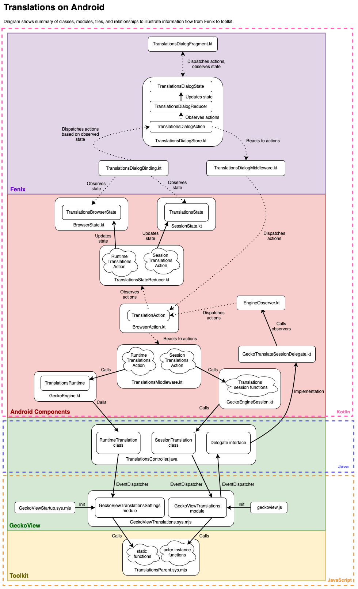

# Creating a new Android feature using existing JavaScript toolkit code

**Author**: [Olivia Hall](mailto:ohall@mozilla.com)


## Usage

The focus of this guide is on how to connect Gecko JavaScript toolkit features to Fenix UI. The goal is to provide a cursory overview of the steps, architecture, and implementation details.

```{note}
Toolkit code in this document refers to JavaScript cross-platform browser code located in the [toolkit directory](https://searchfox.org/mozilla-central/source/toolkit).
```

## Outline

The translations feature on Android will be used as an example feature to illustrate implementation specific details and also architecture.

This document will provide an overview on how to bring an existing JavaScript toolkit feature to Android.

This guide will cover each step by layer in the stack:

* Toolkit - [Identifying and preparing toolkit code](#identifying-and-preparing-toolkit-code)
* GeckoView - [Writing GeckoView APIs to call toolkit code](#writing-geckoview-apis-to-call-toolkit-code)
* Android Components - [Connecting GeckoView APIs in Android Components](#connecting-geckoview-apis-in-android-components)
* Fenix - [Using the new Android Components APIs in Fenix](#using-the-new-android-components-apis-in-fenix)
* Release - [Other considerations](#other-considerations)

```{note}
This guide is not intended to be all encompassing or cover every scenario, but to provide a concrete view with examples on how to bring a JavaScript toolkit feature to Android.
```

```{seealso}
For an alternative approach to connecting with Gecko on the C++ side, please see [this documentation for connecting to C++ code to Java using the JNI](./geckoview-architecture.rst#jni).
```
## Overview

The architecture diagram below outlines the different layers a feature must cross to reach from toolkit all the way to the Fenix UI. The layers include toolkit, GeckoView (GV), Android Components (AC), and finally Fenix. The languages traversed include JavaScript, Java, and Kotlin.

```{important}
This document will traverse layer-by-layer and emphasize key and noteworthy points to attempt to provide a holistic overview of the steps necessary to build a feature. Consulting and revisiting this diagram while reading each section will hopefully help build a mental model of the feature as a whole.
```

Some key files or components for the translations feature include:

**Toolkit:**
* [TranslationsParent.sys.mjs](https://searchfox.org/mozilla-central/rev/a965e3c683ecc035dee1de72bd33a8d91b1203ed/toolkit/components/translations/actors/TranslationsParent.sys.mjs) \- Primary entryway into toolkit for this feature and where most of the key calls (such as `translate()`) or messages (such as `TranslationsParent:OfferTranslation`) originate from.

**GeckoView:**
* [GeckoViewTranslations.sys.mjs](https://searchfox.org/mozilla-central/rev/a965e3c683ecc035dee1de72bd33a8d91b1203ed/mobile/shared/modules/geckoview/GeckoViewTranslations.sys.mjs) \- JavaScript side module which both listens to relevant messages and calls `TranslationsParent`.
* [TranslationsController.java](https://searchfox.org/mozilla-central/rev/a965e3c683ecc035dee1de72bd33a8d91b1203ed/mobile/android/geckoview/src/main/java/org/mozilla/geckoview/TranslationsController.java) \- Java side class which coordinates both [session and runtime](./geckoview-architecture.rst#view-runtime-and-session) specific calls, listens for events, as well as defines a delegate.

**Android Components:**

* [TranslationsMiddleware.kt](https://searchfox.org/mozilla-central/rev/a965e3c683ecc035dee1de72bd33a8d91b1203ed/mobile/android/android-components/components/browser/state/src/main/java/mozilla/components/browser/state/engine/middleware/TranslationsMiddleware.kt#1) \- Observes translations specific actions and reacts accordingly.
* [TranslationsStateReducer.kt](https://searchfox.org/mozilla-central/rev/a965e3c683ecc035dee1de72bd33a8d91b1203ed/mobile/android/android-components/components/browser/state/src/main/java/mozilla/components/browser/state/reducer/TranslationsStateReducer.kt#1) \- Observes translations specific actions and updates the data model state.
* [TranslationsBrowserState.kt](https://searchfox.org/mozilla-central/rev/a965e3c683ecc035dee1de72bd33a8d91b1203ed/mobile/android/android-components/components/browser/state/src/main/java/mozilla/components/browser/state/state/TranslationsBrowserState.kt) \- Global or whole browser data model for translations.(Generally runtime information.)
* [TranslationsState.kt](https://searchfox.org/mozilla-central/rev/a965e3c683ecc035dee1de72bd33a8d91b1203ed/mobile/android/android-components/components/browser/state/src/main/java/mozilla/components/browser/state/state/TranslationsState.kt) \- Session specific data model for translations.

**Fenix:**

* [TranslationsDialogBinding.kt](https://searchfox.org/mozilla-central/rev/a965e3c683ecc035dee1de72bd33a8d91b1203ed/mobile/android/fenix/app/src/main/java/org/mozilla/fenix/translations/TranslationsDialogBinding.kt) \- Observes the various translations state and sends `TranslationsDialogActions`.
* [TranslationsDialogStore.kt](https://searchfox.org/mozilla-central/source/mobile/android/fenix/app/src/main/java/org/mozilla/fenix/translations/TranslationsDialogStore.kt) \- Middleware which tracks translations state for the dialog and defines `TranslationsDialogActions`.
* [TranslationsDialogFragment.kt](https://searchfox.org/mozilla-central/rev/a965e3c683ecc035dee1de72bd33a8d91b1203ed/mobile/android/fenix/app/src/main/java/org/mozilla/fenix/translations/TranslationsDialogFragment.kt) \- Fragment which displays the UI, observes certain states to react, and sends actions.



### Summary of key calls from Fenix to toolkit for a translation

Abbreviated pseduo-call stack for what happens when Fenix's translation dialog is opened and translate is pressed:

**Fenix:**
* [`TranslationsDialogFragment.kt - onCreateView`](https://searchfox.org/mozilla-central/rev/044802a2108a5163bd5288ea18eb6a88234d45f0/mobile/android/fenix/app/src/main/java/org/mozilla/fenix/translations/TranslationsDialogFragment.kt#100)
* [`TranslationsDialogFragment.kt - TranslationsOptionsDialogContent`](https://searchfox.org/mozilla-central/rev/044802a2108a5163bd5288ea18eb6a88234d45f0/mobile/android/fenix/app/src/main/java/org/mozilla/fenix/translations/TranslationsDialogFragment.kt#390)
* [`TranslationsDialogFragment.kt - private fun translate`](https://searchfox.org/mozilla-central/rev/044802a2108a5163bd5288ea18eb6a88234d45f0/mobile/android/fenix/app/src/main/java/org/mozilla/fenix/translations/TranslationsDialogFragment.kt#350)
* [`TranslationsDialogStore.kt - TranslationsDialogAction.TranslateAction`](https://searchfox.org/mozilla-central/rev/044802a2108a5163bd5288ea18eb6a88234d45f0/mobile/android/fenix/app/src/main/java/org/mozilla/fenix/translations/TranslationsDialogStore.kt#317,326)
* [`TranslationsDialogMiddleware.kt - TranslationsDialogAction.TranslateAction`](https://searchfox.org/mozilla-central/rev/044802a2108a5163bd5288ea18eb6a88234d45f0/mobile/android/fenix/app/src/main/java/org/mozilla/fenix/translations/TranslationsDialogMiddleware.kt#76)


**Android Components:**
* [`EngineDelegateMiddleware.kt - TranslationsAction.TranslateAction`](https://searchfox.org/mozilla-central/rev/044802a2108a5163bd5288ea18eb6a88234d45f0/mobile/android/android-components/components/browser/state/src/main/java/mozilla/components/browser/state/engine/middleware/EngineDelegateMiddleware.kt#49)
* [`EngineDelegateMiddleware.kt - private fun translate`](https://searchfox.org/mozilla-central/rev/044802a2108a5163bd5288ea18eb6a88234d45f0/mobile/android/android-components/components/browser/state/src/main/java/mozilla/components/browser/state/engine/middleware/EngineDelegateMiddleware.kt#163)
* [`GeckoEngineSession.kt - override fun requestTranslate`](https://searchfox.org/mozilla-central/rev/044802a2108a5163bd5288ea18eb6a88234d45f0/mobile/android/android-components/components/browser/engine-gecko/src/main/java/mozilla/components/browser/engine/gecko/GeckoEngineSession.kt#979)

**GeckoView:**
* [`TranslationsController.java - public @NonNull GeckoResult<Void> translate`](https://searchfox.org/mozilla-central/rev/044802a2108a5163bd5288ea18eb6a88234d45f0/mobile/android/geckoview/src/main/java/org/mozilla/geckoview/TranslationsController.java#743)
* [`GeckoViewTranslations.sys.mjs - onEvent case "GeckoView:Translations:Translate"`](https://searchfox.org/mozilla-central/rev/044802a2108a5163bd5288ea18eb6a88234d45f0/mobile/shared/modules/geckoview/GeckoViewTranslations.sys.mjs#42)

**Toolkit:**
* [`TranslationsParent.sys.mjs - async translate(fromLanguage, toLanguage, reportAsAutoTranslate)`](https://searchfox.org/mozilla-central/rev/044802a2108a5163bd5288ea18eb6a88234d45f0/toolkit/components/translations/actors/TranslationsParent.sys.mjs#2561)

## Identifying and preparing toolkit code

### Overview of directory structure
| Directory | Platform | Description | Sample Key Files<sup>+</sup> |
| :---- | :---- | :---- | :---- |
| [toolkit](https://searchfox.org/mozilla-central/source/toolkit) | Cross platform | Browser code that may be used on all platforms.  | `*Parent.sys.mjs`, `*Child.sys.mjs`, `*Utils.mjs` |
| [browser](https://searchfox.org/mozilla-central/source/browser) | Desktop | Desktop specific browser and chrome (view layer) code. | Similar to toolkit \+ `*.js`, `*.xhtml` |
| [mobile](https://searchfox.org/mozilla-central/source/mobile) | Android and iOS | Area related to mobile platforms. | Varies based on directory |
| [geckoview](https://searchfox.org/mozilla-central/source/mobile/android/geckoview) and [mobile/android](https://searchfox.org/mozilla-central/source/mobile/android) | Android | GeckoView code provides a Java API surface to interface with Gecko. Much of the top level mobile/android code is under the GeckoView purview.  | `GeckoView*.sys.mjs`, `GeckoView*Child.sys.mjs`, `GeckoView*Parent.sys.mjs`,`*Controller.java` |
| [android-components](https://searchfox.org/mozilla-central/source/mobile/android/android-*s) | Android | Android's code is a reusable Android library that aims to provide a toolbox of building blocks relevant to building a browser. Includes reusable UI and connections to GeckoView as a browser engine. | `*Middleware.kt`, `*StateReducer.kt`, `*State.kt` |
| [fenix](https://searchfox.org/mozilla-central/source/mobile/android/fenix) | Android | Chrome (view layer) code connected to Android's to form the [Firefox on Android](https://www.mozilla.org/en-US/firefox/browsers/mobile/android/) experience. | `*DialogBinding.kt` , `*DialogStore.kt`, `*Fragment.kt` |
| [focus-android](https://searchfox.org/mozilla-central/source/mobile/android/focus-android) | Android | Chrome (view layer) code connected to Android's to form the [Focus (aka Klar)](https://www.mozilla.org/en-US/firefox/browsers/mobile/focus/) experience.  | Same as Fenix |

(<sup>+</sup> Where `*` is the Component name.)

### Identifying toolkit code

The first step is to identify toolkit code to see if the module is already in the [`toolkit` directory.](https://searchfox.org/mozilla-central/source/toolkit)  (See above table for summary of locations.) If this is the case, then it should already be possible to connect it to GeckoView without too many adjustments.

Some adjustments to the toolkit code might also be necessary for it to run on Android. For example, Android does not have a `gBrowser` and code calling `gBrowser` will need to be changed. These minor adjustments can usually be quickly identified through testing. These issues are usually fixed through availability checks or use of `AppConstants.platform \!== "android"` style checks.

An example of this in translations is that the `TranslationsParent` only offers a translation if the user is on the same page. Important to note is that the Android paradigm for windows is different from desktop. For Android, there is always [one window for one tab](./geckoview-architecture.rst#window-model). Because of that, branching behavior to check if on the same current page was added to Android:

[`TranslationsParent.sys.mjs`](https://searchfox.org/mozilla-central/rev/dd8b64a6198ff599a5eb2ca096845ebd6997457f/toolkit/components/translations/actors/TranslationsParent.sys.mjs#735):
```js
// Only offer the translation if it's still the current page.
let isCurrentPage = false;
if (AppConstants.platform !== "android") {
  isCurrentPage = documentURI.spec === this.browsingContext
    .topChromeWindow.gBrowser.selectedBrowser
    .documentURI.spec;
} else {
  // In Android, the active window is the active tab.
  isCurrentPage = documentURI.spec === browser.documentURI.spec;
}
```

An alternative adjustment may also be performing stricter availability checks. For example, on Android, ``BrowserHandler``was sometimes not available and was causing an issue when checking for ``kiosk`` mode (a desktop feature).

[`TranslationsParent.sys.mjs`](https://searchfox.org/mozilla-central/rev/dd8b64a6198ff599a5eb2ca096845ebd6997457f/toolkit/components/translations/actors/TranslationsParent.sys.mjs#647):
```js
// Check that the component is available before de-lazifying lazy.BrowserHandler.
if (Cc["@mozilla.org/browser/clh;1"] && lazy.BrowserHandler?.kiosk) {
  // Pop-ups should not be shown in kiosk mode.
  return;
}
```

Larger refactoring or additions to the toolkit code might include updating functions to connect more elegantly to a GeckoView API or adding GeckoView specific modules or actors to coordinate `toolkit` calls.

Another situation is sometimes there can also be code that could be cross platform and moved to `toolkit` from, for example, `browser`. In that case, evaluating if the non-cross platform specific code can and should be moved to `toolkit` is the first step. Be sure to consult with relevant [code owners](https://firefox-source-docs.mozilla.org/mots/index.html), review groups, and other stakeholders during the evaluation process to ensure refactoring or moving code is the best course of action.

It might also be necessary to inspect desktop chrome (view layer) code (found in the `browser` directory) and move segments to `toolkit` as well. Sometimes there will be chrome level code that prepares raw information into a presentation data structure that could be helpful in `toolkit` for joint use. An example in translations was moving `getLanguageList` from `browser` to `toolkit`, as seen in this [patch](https://phabricator.services.mozilla.com/D190118).

Adding or moving code that is useful and usable on all layers to `toolkit` helps lower the maintenance burden for all teams. A central source of behavior prevents introduction of novel solutions for the same problem and diverging behavior (and bugs\!) between desktop and other platforms.

```{tip}
**Aside on chrome (view layer) code:** One important difference between Android and desktop UI is that desktop chrome is drawn using XUL and other web technologies, while Android uses Android OS base UI platform components. Because of this difference, Android uses a delegate pattern to draw UI on the application layer. As seen later, `onTranslateOffer` will be a delegate used to inform the AC and then Fenix layer to draw UI to popup and offer a translation.
```

Some of these changes and why they are helpful will become more clear later when designing the GeckoView APIs. For example, it might be better to combine a sequence of toolkit calls into one function. That function will then be the only function linked to the public Java surface. This will improve performance and make the API usage clearer.

One way to begin to get a sense of how the toolkit code works on Android during early development is to create a GeckoView module or connect to an existing module, add a message receiver in the module, add a message sender on the Java side, and call the message sender from Java. Important to note is GeckoView uses the [actor pair architecture](https://firefox-source-docs.mozilla.org/dom/ipc/jsactors.html) and [modules](https://gist.github.com/agi/c900f3e473ff681158c0c907e34780e4#actors).

Two examples of different options on how to perform this connection are outlined below in the [example directly connecting toolkit actors](#example-directly-connecting-toolkit-actors) and the [example using a GeckoView module to call toolkit](#example-using-a-geckoview-module-to-call-toolkit). Testing this way while outlining the APIs will help provide a feedback loop on what functionality is needed.

### Example directly connecting toolkit actors

There was not a translations example available for this situation, so in this example, the toolkit Parent and Child actors are in use with [GeckoViewAutocomplete.sys.mjs](https://searchfox.org/mozilla-central/source/mobile/shared/modules/geckoview/GeckoViewAutocomplete.sys.mjs) coordinating on the JavaScript side and [Autocomplete.java](https://searchfox.org/mozilla-central/source/mobile/android/geckoview/src/main/java/org/mozilla/geckoview/Autocomplete.java) on the Java side.

First, items must be declared statically in [geckoview.js](https://gist.github.com/agi/c900f3e473ff681158c0c907e34780e4#actors) to register them.

[`geckoview.js`:](https://searchfox.org/mozilla-central/rev/a965e3c683ecc035dee1de72bd33a8d91b1203ed/mobile/shared/chrome/geckoview/geckoview.js#786)

```js
{
  name: "GeckoViewAutocomplete",
    actors: {
      FormAutofill: {
        parent: {
          esModuleURI: "resource://autofill/FormAutofillParent.sys.mjs",
        },
        child: {
          esMoaduleURI: "resource://autofill/FormAutofillChild.sys.mjs",
          events: {
            focusin: {},
            "form-submission-detected": {},
          },
        },
        allFrames: true,
        messageManagerGroups: ["browsers"],
      },
    },
  },
},
```

### Example using a GeckoView module to call toolkit

The example shows connecting a GeckoView module for use and how toolkit calls may be referenced.

[`geckoview.js`](https://searchfox.org/mozilla-central/rev/a965e3c683ecc035dee1de72bd33a8d91b1203ed/mobile/shared/chrome/geckoview/geckoview.js#856):
```js
{
  name: "GeckoViewTranslations",
  onInit: {
  resource: "resource://gre/modules/GeckoViewTranslations.sys.mjs",
},

```

[`GeckoViewTranslations.sys.mjs`](https://searchfox.org/mozilla-central/rev/a965e3c683ecc035dee1de72bd33a8d91b1203ed/mobile/shared/modules/geckoview/GeckoViewTranslations.sys.mjs):

```js
// TranslationsParent is in toolkit
ChromeUtils.defineESModuleGetters(lazy, {
  TranslationsParent: "resource://gre/actors/TranslationsParent.sys.mjs",
});

…
// Static call example
lazy.TranslationsParent.getIsTranslationsEngineSupported()

// Actor call example was registered in ActorManagerParent.sys.mjs
this.getActor("Translations").restorePage();

// Setting up a Java API (see below) can also be used for more control of calling a specific function. The idea here is just to set up a framework for exploring that could become the foundation of the final API.

```

Connecting the relevant toolkit code to the GeckoView side during the early exploratory process can yield early information on what is working and what will need special attention.

## Writing GeckoView APIs to call toolkit code

Designing a GeckoView API should take considerable thought and care. GeckoView is a public API that anyone can use to use Gecko on Android. As such, well designed APIs should expose necessary functionality, be well documented for different product usage, and be extensible for future expansions. API changes are publicly listed in a CHANGELOG and also an API hash is generated for each change ([see contributor guide for details](./geckoview-quick-start.rst#updating-the-changelog-and-api-documentation)). See this [GeckoView architecture guide](./geckoview-architecture.rst#api) for more information.

### Outline Toolkit Calls and Data

One way to begin is to outline all of the toolkit function calls or messages that the feature will need to interact with. This can be achieved through looking at the feature designs and listing each piece of functionality or through looking at desktop code and creating a list of what was called. For example, with translations, calling the toolkit translate function was an easily identifiable call to list on this document. Additionally, functions should be noted if they should be called automatically under certain conditions, such as when an `onLoad` event occurs. For example, the `TranslationsParent` sends a state message that GeckoView listens to and reacts to by activating a delegate call. On the Android Components side, this delegate's message is used to update various state stores and sometimes UI.

It is also helpful to note if the call should be a [session or runtime call](./geckoview-architecture.rst#view-runtime-and-session). Session calls require the state of the page to be known. For example, requesting a page restore. These calls should not outlive the session. Runtime calls do not require the state of the page. They can be statically declared functions or anything else that does not depend on session state. For example, changing a preference.

```{tip}
**Aside on preferences:** Generally Gecko preferences can be connected specifically on the Java side in [GeckoRuntimeSettings.java](https://searchfox.org/mozilla-central/source/mobile/android/geckoview/src/main/java/org/mozilla/geckoview/GeckoRuntimeSettings.java), but some cases may wish to run through the toolkit if there is additional setting/getting logic.
```

This call and message identification step is important and should not be skipped because it will help drive API design decisions. Be sure to note any missing calls or data that the feature needs and does not already exist in the toolkit. New toolkit calls or the GeckoView module can help fill out these gaps. This process is iterative, but a good foundation of what is needed will help with organization.

#### Example early outline of toolkit calls for translations:

```
Toolkit outline:

Session:

* void translate(fromLanguage, toLanguage)
  * Will cause a TranslationsParent:LanguageState state change.
* void restorePage()
  * Will cause a TranslationsParent:LanguageState state change.

Runtime:

* bool getIsTranslationsEngineSupported()
* string[] getPreferredLanguages()
* long getExpectedTranslationDownloadSize(fromLanguage, toLanguage)
  * ToDo: Not yet a toolkit option because download size is particularly important on Android.

Messages to listen to:

* TranslationsParent:LanguageState
  * Provides information about the translation state on the page.
* TranslationsParent:OfferTranslation
  * Whether the page should recommend a translation.

Data objects:

* Language
  * String display name
  * String BCP 47 Code
```
This list will change and grow as more details are uncovered.

### Map toolkit calls to Java equivalent

At this point, it is now possible to begin outlining the GeckoView API for functions that should be called directly as well as begin designing the delegate.

The GeckoView Java side uses a `GeckoResult` as a message wrapper to communicate with the GeckoView JavaScript side. The JavaScript side will send a callback to the `GeckoResult` for an `onEvent` message or else send a new message to Java using the [`EventDispatcher`](./geckoview-architecture.rst#eventdispatcher). A `GeckoResult` is similar to a JavaScript promise and allows results to be returned asynchronously. In general, the return type of the `GeckoResult` will be the same data type as on the JavaScript side. Mapping can be used to change or format results. A `GeckoBundle` is used to serialize this information. Recommend also renaming functions on the Java side to match current naming patterns. Decisions will also need to be made if the result should be deserialized into a data object. If a data object is needed, implementing `fromBundle` and `toBundle` on the object is the typical setup.

For example, the JS toolkit signature `string[] getPreferredLanguages()` could have a GeckoView Java corresponding caller signature be `GeckoResult<List<String>> preferredLanguages` or `GeckoResult<List<Language>> preferredLanguages`.

### A quick overview of GeckoView delegates

If the application needs to listen to an event or react to information, then there is a good chance the API will also need [a delegate](./geckoview-architecture.rst#delegates). GeckoView only provides base functionality. Embedders of GeckoView, such as Android Components, which powers Fenix, need to implement the specifics of what the reaction should be to an event. If the app needs to do something in response to an event, such as paint UI,  then the embedding application needs to implement the delegate.

For example, a UI/UX requirement for translations might be: “When the user visits a page not in their set of expected known languages, then pop-up the translate feature dialog.” GeckoView does not implement this UI, but provides a mechanism for this to occur and others to implement the work. So, in this case, in toolkit, there is already a message called `TranslationsParent:OfferTranslation` that signals when a translation should be offered. To implement the functionality, a listener on the GeckoView JavaScript side should be set up to tell the GeckoView Java delegate that the event occurred. If the embedder implements this delegate, then that app can react as needed to this information.

### Example outline of mapping toolkit calls to new API

Notice for this outline that the original toolkit calls outlined above are now outlined with how they will be presented in the public API. `GeckoResult<Void>` is used if we just need to know the call successfully resolved, `void` if no feedback is required to the caller, `GeckoResult<T>` is used if a return value is required.

For the delegate outline, notice that each is reacting to a specific message broadcast by the `TranslationsParent`. Other message types or signals could also be used to activate the delegate.
```
GeckoView API outline:

Session:

* GeckoResult<Void> translate(String fromLanguage, String toLanguage, TranslationOptions options)
  * The use of options is to make this function more extensible.
  * Toolkit call: translate(fromLanguage, toLanguage)
* GeckoResult<Void> restoreOriginalPage()
  * Toolkit call: void restorePage()

Runtime:

* GeckoResult<Boolean> isTranslationsEngineSupported()
  * Toolkit call: bool getIsTranslationsEngineSupported()
* GeckoResult<List<String>> preferredLanguages
  * Toolkit call: string[] getPreferredLanguages
* GeckoResult<Long> checkPairDownloadSize(String fromLanguage, String toLanguage)
  * Toolkit call: Needs to be created.
* GeckoResult<List<LanguageModel>> listModelDownloadStates()
  * Toolkit call: Needs to be created.

Delegate:

* void onOfferTranslate(GeckoSession session)
  * Will listen to message TranslationsParent:LanguageState
* void onTranslationStateChange(GeckoSession session, TranslationState translationState)
  * Will listen to message TranslationsParent:OfferTranslation

```
Notice in the example that most items directly map from a JavaScript to a Java equivalent, but others needed a new object. Usually the function name is kept similar, but might be refined to make more sense in context. The state listeners were mapped to what will be a delegate.

```{seealso}
See the [GeckoView Translations API RFC](https://docs.google.com/document/d/1pMn3IZthtsWPzg-tBGRGoeWebIaI8KJt42odiMTjMII/edit?tab=t.0#heading=h.rkn3k63wwhae) for a more extended example. Or other [design documents here](https://firefox-source-docs.mozilla.org/mobile/android/geckoview/design/index.html).
```
### Proposed API Review

It is highly recommended that you send a draft of proposed GeckoView API changes or additions to [geckoview-reviewers](https://firefox-source-docs.mozilla.org/mots/index.html#core-geckoview) before implementing. The [RFC template may be found here](https://docs.google.com/document/d/1oHc4BbqM8pzEtVIq-MD1s2itRYAGTVQ8LkyHvy4s168/edit?tab=t.0#heading=h.ls1dr18v7zrx). This is especially important for non-trivial additions or changes. Some examples of non-trivial changes are introducing an API to support a new end-to-end feature, introduction of a new class or module, significant updates to an existing API, or introduction of an API that traverses multiple layers. Examples of trivial changes are introducing a new preference setting API, adding or updating parameters or responses, or minor updates to reflect changes in Gecko. (Also, extremely important note, public APIs cannot be directly changed, they must go through a [deprecation process](./geckoview-quick-start.rst#updating-the-changelog-and-api-documentation) to avoid [breaking changes](https://firefox-source-docs.mozilla.org/mobile/android/geckoview/design/breaking-changes.rst).) The review group can provide comments and recommendations before implementing. This can save time and potential issues during code review.

```{important}
Highly recommend creating an [RFC](https://docs.google.com/document/d/1oHc4BbqM8pzEtVIq-MD1s2itRYAGTVQ8LkyHvy4s168/edit?tab=t.0#heading=h.ls1dr18v7zrx) for proposed GeckoView API additions or changes and consult [Core: GeckoView](https://firefox-source-docs.mozilla.org/mots/index.html#core-geckoview) for recommendations.

The group can help ensure the API will meet the existing architecture requirements.
```

### Overview of Implementing APIs

After creating a list of the toolkit endpoints and GeckoView API endpoints and asking for review from `geckoview-reviewers`, now is a good time to begin implementing the connections. The goal of this part of the guide is to provide a gist of how an Android implementation is set up and key structures. There is a lot of variety in how APIs are implemented based on existing frameworks and requirements, so no guide can cover them all. However, hopefully this overview will outline the general structure of a possible solution.

Generally, a new Java class should be made to encompass the API, unless the feature is small or an extension of an existing feature. A rule of thumb is for a small change related to content, the API might simply be placed on `GeckoSession.java` and, for a small change related to settings, the API might be placed on `GeckoRuntime.java`. In the case of translations, which is a bigger feature, a `TranslationsController` class, which has both a session and runtime component was selected. The purpose of the `TranslationsController` is to organize and coordinate any calls involving translations in a contained manner. Much of the work was patterned similarly to the `WebExtensionsController`. Please see the [design document](https://docs.google.com/document/d/1pMn3IZthtsWPzg-tBGRGoeWebIaI8KJt42odiMTjMII/edit?tab=t.0#heading=h.rkn3k63wwhae) for more details. Deciding how a new feature should be structured would be a good discussion in the recommended API RFC.

```{seealso}
Please see the [GeckoView Contributor Guide](./geckoview-quick-start.rst) for more information on the specifics of linting, testing, generating API keys or the [Junit Test Framework](./junit.rst) guide for testing basics.
```

#### Session API Example

One of the requirements of the translations feature is to translate a page. For GeckoView, this is a session level API.

Adding a new module on the JS side:

[`GeckoViewTranslations.sys.mjs`](https://searchfox.org/mozilla-central/rev/0b189f017bc9d48b62012205c5b9f8a8b560497b/mobile/shared/modules/geckoview/GeckoViewTranslations.sys.mjs#44):
```js
// Notice the use of GeckoViewModule to inherit behaviors`
export class GeckoViewTranslations extends GeckoViewModule {
onInit() {
     debug`onInit`;
     // This listener is going to be listening for messages from
     // the Java side`
     this.registerListener(["GeckoView:Translations:Translate",]);

...

onEvent(aEvent, aData, aCallback) {
    debug`onEvent: event=${aEvent}, data=${aData}`;
    switch (aEvent) {
        case "GeckoView:Translations:Translate":
            try {
                this.getActor("Translations").translate(
                  aData.fromLanguage,
                  aData.toLanguage,
                  /* reportAsAutoTranslate */ false
                ).then(
                () => aCallback.onSuccess(),
                // An error occurred calling translate
                error => aCallback.onError(`Could not translate: ${error}`)
                );
            } catch (error) {
              // This will let us know a problem occurred with finding the actor.
              aCallback.onError(C`ould not translate: ${error}`);
            }
    break;
...
```
Be sure to add to `mozbuild` this new file and register it in `geckoview.js`.

Now that there is a JS listener, now add the Java side:

[`TranslationsController.java`](https://searchfox.org/mozilla-central/rev/bee16356819e33a1a4f219b4df9d20d1713bc3d1/mobile/android/geckoview/src/main/java/org/mozilla/geckoview/TranslationsController.java#808):

```java
public class TranslationsController {
  public static class SessionTranslation {

    // Needs to match what the JS side is listening for
    private static final String TRANSLATE_EVENT = "GeckoView:Translations:Translate";

    // Be sure to register this in GeckoSession.java.
    public SessionTranslation(final GeckoSession session) {
        mSession = session;
    }

    @AnyThread
    private @NonNull GeckoResult<Void> baseTranslate(
      @NonNull final String fromLanguage,
      @NonNull final String toLanguage) {

        final GeckoBundle bundle = new GeckoBundle(2);
        bundle.putString("fromLanguage", fromLanguage);
        bundle.putString("toLanguage", toLanguage);

        // The GeckoResult will not resolve until the JS callback.onSuccess() returns.
        return mSession
        .getEventDispatcher()
        .queryVoid(TRANSLATE_EVENT, bundle)
        .map(
          result -> result,
          exception -> new TranslationsException(TranslationsException.ERROR_COULD_NOT_TRANSLATE));
    }
  }
}
```

Be sure to register this new session messenger in GeckoSession.java and add appropriate getters and setters. This function can now be called on the Java side from anywhere suitable.

```{seealso}
See [the patch for initially adding the GeckoView session APIs](https://phabricator.services.mozilla.com/D189228) for a more extended example with more details.
```

#### Session Delegate API Example

Adding a delegate that listens to an event is similar to the session API example, with just the addition of listening for the code. In this example, an `Offer` event listener is set up on the Java session side of the translations controller.  The JavaScript side then registers a listener for the toolkit parent’s message and sends an `Offer` message to the Java side

#### Example setting up the delegate and listener for the triggering event:

* Notice `onOfferTranslate` is only a stub. The implementation will be set up in the embedding application.

[`TranslationsController.java`](https://searchfox.org/mozilla-central/rev/bee16356819e33a1a4f219b4df9d20d1713bc3d1/mobile/android/geckoview/src/main/java/org/mozilla/geckoview/TranslationsController.java#927):

```java
public class TranslationsController {
  public static class SessionTranslation {

    // Event that the Java side will respond to.
    private static final String ON_OFFER_EVENT = "GeckoView:Translations:Offer";

    public SessionTranslation(final GeckoSession session) {
          mSession = session;
          // The handler is how we can listen for changes.
          mHandler = new SessionTranslation.Handler(mSession);
    }

    @AnyThread
    public @NonNull Handler getHandler() {
          return mHandler;
    }

    @AnyThread
    public interface Delegate {
        // Notice this is a stub. The implementation will be provided by the GeckoView embedder.
        default void onOfferTranslate(@NonNull final GeckoSession session) {}
    }

    // Setup a handler to listen for events.
    static class Handler extends GeckoSessionHandler<SessionTranslation.Delegate> {
        private final GeckoSession mSession;
        private Handler(final GeckoSession session) {
          super(
          "GeckoViewTranslations",
          session,
          new String[] {
          ON_OFFER_EVENT,
          });
          mSession = session;
      }

      @Override
      public void handleMessage(
      final Delegate delegate,
      final String event,
      final GeckoBundle message,
      final EventCallback callback) {
        if (delegate == null) {
                Log.w(LOGTAG, "The translations session delegate is not set.");
                return;
        }

        if (ON_OFFER_EVENT.equals(event)) {
                // Trigger delegate because the condition was met.
                delegate.onOfferTranslate(mSession);
        return;
      }
    }
  }
}
```
[`GeckoViewTranslations.sys.mjs`](https://searchfox.org/mozilla-central/rev/0b189f017bc9d48b62012205c5b9f8a8b560497b/mobile/shared/modules/geckoview/GeckoViewTranslations.sys.mjs#111):

```js
onEnable() {
  debug `onEnable`;
   // The event from the parent.
   this.window.addEventListener("TranslationsParent:OfferTranslation", this);
 }


 onDisable() {
  debug `onDisable`;
  this.window.removeEventListener("TranslationsParent:OfferTranslation",this);
 }

handleEvent(aEvent) {
  debug`handleEvent: ${aEvent.type}`;
  switch (aEvent.type) {
    case "TranslationsParent:OfferTranslation":
     // Send the event to GeckoView’s Java-side.
     this.eventDispatcher.sendRequest({
       type: "GeckoView:Translations:Offer",
       });
     break;
  }
}
```

```{seealso}
See [the patch for initially adding the GeckoView session APIs](https://phabricator.services.mozilla.com/D189228) for a more extended example with more details.
```

#### Runtime API Example

A runtime endpoint is similar to a session endpoint, with a few key differences. The differences are a different event dispatcher and events are listened to differently.

[`GeckoViewTranslations.sys.mjs`](https://searchfox.org/mozilla-central/rev/0b189f017bc9d48b62012205c5b9f8a8b560497b/mobile/shared/modules/geckoview/GeckoViewTranslations.sys.mjs#145):
```js
export const GeckoViewTranslationsSettings = {

  async onEvent(aEvent, aData, aCallback) {
    debug`onEvent ${aEvent} ${aData}`;
      switch (aEvent) {
        case "GeckoView:Translations:IsTranslationEngineSupported": {
         try {
           aCallback.onSuccess(lazy.TranslationsParent.getIsTranslationsEngineSupported());
         ...
}
```

Registered in [`GeckoViewStartup.sys.mjs`](https://searchfox.org/mozilla-central/rev/0b189f017bc9d48b62012205c5b9f8a8b560497b/mobile/shared/components/geckoview/GeckoViewStartup.sys.mjs#204):
```js
GeckoViewUtils.addLazyGetter(this, "GeckoViewTranslationsSettings", {
	module: "resource://gre/modules/GeckoViewTranslations.sys.mjs",
	ged: [
		"GeckoView:Translations:IsTranslationEngineSupported",
		"GeckoView:Translations:PreferredLanguages",
		"GeckoView:Translations:ManageModel",
		"GeckoView:Translations:TranslationInformation",
		"GeckoView:Translations:ModelInformation",
	],
});
```

[`TranslationsController.java`](https://searchfox.org/mozilla-central/rev/bee16356819e33a1a4f219b4df9d20d1713bc3d1/mobile/android/geckoview/src/main/java/org/mozilla/geckoview/TranslationsController.java#43):

```java
public class TranslationsController {
  public static class RuntimeTranslation {
    // Events dispatched to toolkit translations
    private static final String ENGINE_SUPPORTED_EVENT =
    "GeckoView:Translations:IsTranslationEngineSupported";

    @AnyThread
    public static @NonNull GeckoResult<Boolean> isTranslationsEngineSupported() {
    // Notice this isn’t the same event dispatcher as the session dispatcher and how to get the return value.
      return EventDispatcher.getInstance()
        .queryBoolean(ENGINE_SUPPORTED_EVENT)
        .map(
          result -> result,
          exception -> new TranslationsException(TranslationsException.ERROR_ENGINE_NOT_SUPPORTED));
    }
  }
}
```

```{seealso}
See the [initial translations runtime patch](https://phabricator.services.mozilla.com/D189229) for more on this example.
```

#### Testing

On the GeckoView side, the most common test is a junit or plain mochitest. Cross-platform tests generally run as well. The tests for the GeckoView side of translations may be found in [TranslationsTests.kt](http://TranslationsTests.kt) or [test\_geckoview\_translations.html](https://searchfox.org/mozilla-central/source/mobile/shared/modules/geckoview/test/mochitest/test_geckoview_translations.html) for reference.

```{seealso}
See [junit testing guide](./junit.rst#the-test-runner-extension) for more details.
```

#### GeckoView Example

It is highly recommended at this point to make a minimal menu option in GeckoView Example (GVE) in `GeckoViewActivity.java` to help with testing any new feature. It is an important step because it can be used to validate the API as well as for later use when determining which layer of the Android stack that the bug is on. This UI is only for internal testing and can be adjusted by simply adding an option on the menu.

Example add a new item to the GVE menu with some basic test functionality:

[`GeckoViewActivity.java`](https://searchfox.org/mozilla-central/rev/206eaea9a2fd4307da16e1614cd934920368165a/mobile/android/geckoview_example/src/main/java/org/mozilla/geckoview_example/GeckoViewActivity.java#1340):
```java
// Member variables to help manage states for UI
private String mDetectedLanguage = null;
private boolean mExpectedTranslate = false;
session.setTranslationsSessionDelegate(new ExampleTranslationsSessionDelegate());

// Implement the delegate for what makes sense in this sample
private class ExampleTranslationsSessionDelegate
    implements TranslationsController.SessionTranslation.Delegate {
  @Override
  public void onOfferTranslate(@NonNull GeckoSession session) {
    Log.i(LOGTAG, "onOfferTranslate");
  }

  @Override
  public void onExpectedTranslate(@NonNull GeckoSession session) {
    Log.i(LOGTAG, "onExpectedTranslate");
    mExpectedTranslate = true;
  }

  @Override
  public void onTranslationStateChange(
      @NonNull GeckoSession session,
      @Nullable TranslationsController.SessionTranslation.TranslationState translationState) {
    Log.i(LOGTAG, "onTranslationStateChange");
    if (translationState.detectedLanguages != null) {
      mDetectedLanguage = translationState.detectedLanguages.docLangTag;
    }
  }
}

// Manage state of menu item
public boolean onPrepareOptionsMenu(Menu menu) {
  menu.findItem(R.id.translate).setVisible(mExpectedTranslate);
}

// Manage action of menu item
public boolean onOptionsItemSelected(MenuItem item) {
  ...
  case R.id.translate:
    translate(session);
    break;
}

// Menu action
private void translate(GeckoSession session) {
  // Specific UI details, logs, etc.
  // Call the related API
  session.getSessionTranslation().translate(fromLang, toLang, null);
}
```

```{seealso}
See [example PR for more details](https://phabricator.services.mozilla.com/D189228).
```

## Connecting GeckoView APIs in Android Components

Now that the basic GeckoView APIs are set up, the next step is to bring them to Android Components (AC). Android Components provides a set of tools for Fenix, Focus, and any other consumer to use to create their own browser. It does everything from orchestrating calls from Gecko to providing basic reusable UI. Any browser implementation could theoretically be substituted in its browser engine. Because of that, it is important to note then that any code outside of the `gecko` folder namespace should use generic and browser implementation agnostic language.

Generally, many of the design decisions in GeckoView will have a parallel in Android Components. For example, session items should be added to `GeckoEngineSession` and runtime items should be connected to `GeckoEngine`. This guide will briefly outline how this typically works.

### Connecting to GeckoEngineSession

This example shows how to connect the basic `translate` function established in GeckoView to Android components. This is a session level API.

In [`EngineSession.kt`](https://searchfox.org/mozilla-central/rev/0b189f017bc9d48b62012205c5b9f8a8b560497b/mobile/android/android-components/components/concept/engine/src/main/java/mozilla/components/concept/engine/EngineSession.kt#1018):
```kotlin
abstract fun requestTranslate(
    fromLanguage: String,
    toLanguage: String,
    options: TranslationOptions?,
)
```

In [`GeckoEngineSession.kt`](https://searchfox.org/mozilla-central/rev/0b189f017bc9d48b62012205c5b9f8a8b560497b/mobile/android/android-components/components/browser/engine-gecko/src/main/java/mozilla/components/browser/engine/gecko/GeckoEngineSession.kt#979) implement the method:
```kotlin
override fun requestTranslate(
fromLanguage: String,
toLanguage: String,
options: TranslationOptions?,
) {
  // Note: Simplified for clarity

  // Here we have access to GeckoView and can perform the call
  geckoSession.sessionTranslation!!.translate(fromLanguage, toLanguage, geckoOptions).then({

  // This is a common pattern for allowing observers to react to the change
  // Especially important is the store dispatcher which is observing to update session state. That state can then be used to show the waiting UI.
    notifyObservers {
      onTranslateComplete(TranslationOperation.TRANSLATE)
    }
      GeckoResult<Void>()
    },
    {
      // Similarly, this is a way to transmit an issue occurred
      throwable ->
        logger.error("Request for translation failed: ", throwable)
        notifyObservers {
          onTranslateException(TranslationOperation.TRANSLATE, throwable.intoTranslationError())
        }
      GeckoResult()
  })
}
```

```{seealso}
For more details on this session example [see this pull request](https://github.com/mozilla-mobile/firefox-android/pull/4231/files).
```

### Managing State
This guide will only provide code examples on the basics of connecting the GV API to AC.  However, for completeness, this section will outline the importance of managing state in AC. In general, AC uses Flux architecture to coordinate data flow. If an action occurs that will change the state or require a reaction, then setting up an observer is the typical pattern. One of the key observers is almost always a store dispatcher which will dispatch an action to the store. The action will then be watched for by a state reducer. The state reducer then will properly update the data store model with the correct information.

Recommend reviewing [Fenix’s Architecture Overview](https://firefox-source-docs.mozilla.org/mobile/android/fenix/architecture-overview.html) for more information, as the concepts apply the same to Android Components.

Briefly, an example outline of how state propagates through the app:

* Translate was [completed for the session](https://searchfox.org/mozilla-central/rev/0b189f017bc9d48b62012205c5b9f8a8b560497b/mobile/android/android-components/components/browser/engine-gecko/src/main/java/mozilla/components/browser/engine/gecko/GeckoEngineSession.kt#1003), which calls: ``notifyObservers{onTranslateComplete}``
* An [observer](https://searchfox.org/mozilla-central/rev/0b189f017bc9d48b62012205c5b9f8a8b560497b/mobile/android/android-components/components/browser/state/src/main/java/mozilla/components/browser/state/engine/EngineObserver.kt#489) of `onTranslateComplete` then calls: ``store.dispatch(TranslationsAction.TranslateSuccessAction(tabId)``
* [Reducers](https://searchfox.org/mozilla-central/source/mobile/android/android-components/components/browser/state/src/main/java/mozilla/components/browser/state/reducer/TranslationsStateReducer.kt#113) and [Middleware](https://searchfox.org/mozilla-central/source/mobile/android/android-components/components/browser/state/src/main/java/mozilla/components/browser/state/engine/middleware/TranslationsMiddleware.kt#323) for the `TranslateSuccessAction:`
  * Send [telemetry](https://searchfox.org/mozilla-central/source/mobile/android/fenix/app/src/main/java/org/mozilla/fenix/telemetry/TelemetryMiddleware.kt#174)
  * Update the state of ``isTranslated`` on ``SessionState.translationsState`` to ``true``
    * Store [observers](https://searchfox.org/mozilla-central/rev/0b189f017bc9d48b62012205c5b9f8a8b560497b/mobile/android/fenix/app/src/main/java/org/mozilla/fenix/translations/TranslationsDialogBinding.kt#135) connected to [UI](https://searchfox.org/mozilla-central/rev/0b189f017bc9d48b62012205c5b9f8a8b560497b/mobile/android/fenix/app/src/main/java/org/mozilla/fenix/translations/TranslationsDialogFragment.kt#203) will react to ``isTranslated``

### Connecting a Session Delegate

A delegate can be implemented as a session or runtime delegate depending on the area of code. This should have already been established in the GeckoView layer, but this pattern will propagate on into Android Components.

For example, `onOfferTranslate` needs to be implemented in AC.

[`GeckoTranslateSessionDelegate.kt`](https://searchfox.org/mozilla-central/source/mobile/android/android-components/components/browser/engine-gecko/src/main/java/mozilla/components/browser/engine/gecko/translate/GeckoTranslateSessionDelegate.kt) is created in the Gecko namespace:
```kotlin
internal class GeckoTranslateSessionDelegate(
private val engineSession: GeckoEngineSession,
) : TranslationsController.SessionTranslation.Delegate {

  override fun onOfferTranslate(session: GeckoSession) {
    // Using the notify observers pattern to tell other areas of the app a translation offer occurred
    engineSession.notifyObservers {
      onTranslateOffer()
    }
  }
}
```

[`GeckoEngineSession.kt`](https://searchfox.org/mozilla-central/source/mobile/android/android-components/components/browser/engine-gecko/src/main/java/mozilla/components/browser/engine/gecko/GeckoEngineSession.kt):

```kotlin
// Register delegate
geckoSession.translationsSessionDelegate = GeckoTranslateSessionDelegate(this)
```

[`EngineObserver.kt`](https://searchfox.org/mozilla-central/rev/0b189f017bc9d48b62012205c5b9f8a8b560497b/mobile/android/android-components/components/browser/state/src/main/java/mozilla/components/browser/state/engine/EngineObserver.kt#480)

```kotlin
override fun onTranslateOffer() {
  // Send a TranslateOfferAction that will eventually be used to update the translations session store
  store.dispatch(TranslationsAction.TranslateOfferAction(tabId = tabId, isOfferTranslate = true))
}
```

[`TranslationsStateReducer.kt`](https://searchfox.org/mozilla-central/rev/0b189f017bc9d48b62012205c5b9f8a8b560497b/mobile/android/android-components/components/browser/state/src/main/java/mozilla/components/browser/state/reducer/TranslationsStateReducer.kt#41):

```kotlin
is TranslationsAction.TranslateOfferAction -> {
	state.copyWithTranslationsState(action.tabId) {
	  it.copy(
		isOfferTranslate = action.isOfferTranslate,)
	}
}
```

The ``isOfferTranslate`` on the ``TranslationsState`` can then be used by Fenix in the UI to respond appropriately and offer a translation.

### Connecting to GeckoEngine

This part is similar in form as adding a session AC API and will be skipped in this guide. However, in general, the interface will be placed in ``Engine.kt`` (analogous to ``EngineSession.kt`` earlier) and `GeckoEngine.kt` for the implementation (similar to ``GeckoEngineSession.kt``).

```{seealso}
See this [example pull request](https://github.com/mozilla-mobile/firefox-android/pull/4521/files) with more details for a concrete example.
```

### Testing

Tests on the AC side generally correspond to the filename where it was added. For example, translation tests may be found in [GeckoEngineTest.kt](https://searchfox.org/mozilla-central/rev/0b189f017bc9d48b62012205c5b9f8a8b560497b/mobile/android/android-components/components/browser/engine-gecko/src/test/java/mozilla/components/browser/engine/gecko/GeckoEngineTest.kt#3550), [GeckoTranslateSessionDelegateTest.kt](https://searchfox.org/mozilla-central/source/mobile/android/android-components/components/browser/engine-gecko/src/test/java/mozilla/components/browser/engine/gecko/translate/GeckoTranslateSessionDelegateTest.kt), [TranslationsActionTest.kt](https://searchfox.org/mozilla-central/source/mobile/android/android-components/components/browser/state/src/test/java/mozilla/components/browser/state/action/TranslationsActionTest.kt), and [TranslationsMiddlewareTest.kt](https://searchfox.org/mozilla-central/source/mobile/android/android-components/components/browser/state/src/test/java/mozilla/components/browser/state/engine/middleware/TranslationsMiddlewareTest.kt).

```{seealso}
See [Fenix’s testing guidelines for more information.](https://firefox-source-docs.mozilla.org/mobile/android/fenix/Development-Test-Plan.html)
```

### Reference Browser or Sample Browser

Like the GeckoView Example (GVE) browser, there is also an Android Components layer test browser called Reference Browser, also known as sample browser. It is highly recommended that you add a minimal UI to check the AC connection at this step. Again, for the same reasons as GVE, it is useful for both testing and debugging which layer of the Android stack an issue is occurring on.

To add a menu option to Reference Browser:

[`DefaultComponents.kt`](https://searchfox.org/mozilla-central/rev/206eaea9a2fd4307da16e1614cd934920368165a/mobile/android/android-components/samples/browser/src/main/java/org/mozilla/samples/browser/DefaultComponents.kt#321):

```kotlin
 private val menuItems by lazy {
  ...,
  SimpleBrowserMenuItem("Translate (auto)") {
      var detectedFrom =
          store.state.selectedTab?.translationsState?.translationEngineState
              ?.detectedLanguages?.documentLangTag
              ?: "en"
      var detectedTo =
          store.state.selectedTab?.translationsState?.translationEngineState
              ?.detectedLanguages?.userPreferredLangTag
              ?: "en"
      sessionUseCases.translate.invoke(
          fromLanguage = detectedFrom,
          toLanguage = detectedTo,
          options = null,
      )
  },
}
```
```{seealso}
Please [see this PR](https://github.com/mozilla-mobile/firefox-android/pull/4231/files#diff-3f5014b9ddff0dd60214e8d40638a54391901e134646fd22de888a35fbcc98f7) for an extended example.
```

## Using the new Android Components APIs in Fenix

Now that the Android Components connection has been established, it is now possible to add the feature to Fenix. This part is highly dependent on the UI/UX designs and objectives for the feature. This section will only show a cursory example of how AC and Fenix UI may interact as a reference.

### Example Translating

```{note}
This example uses a Fenix layer store and action for the dialog as well (`TranslationsDialogState`, `TranslationsDialogAction`, and `TranslationsDialogMiddleware`). In many cases, using the Android Components browser state is appropriate as well. Translations added this framework because there was potentially more UI state than captured in the Android Components options. However, for these examples, either the extra Fenix framework or directly using the AC framework would have been good choices.
```

Use cases should only be established for reference browser work. It isn’t an active pattern Fenix is using anymore, but translations did use it for the Reference Browser.

Fenix’s ``TranslationsDialogAction.TranslateAction`` maps directly to AC’s ``TranslationsAction.TranslateAction`` in order to pass and capture some additional ``TranslationsDialogState`` information. ``TranslationsDialogBinding`` helps map over state into ``TranslationsDialogState``.

```{seealso}
See [Fenix Architecture Overview](https://firefox-source-docs.mozilla.org/mobile/android/fenix/architecture-overview.html) for more guidance.
```

[`TranslationsDialogFragment.kt`](https://searchfox.org/mozilla-central/source/mobile/android/fenix/app/src/main/java/org/mozilla/fenix/translations/TranslationsDialogFragment.kt):
```kotlin
private lateinit var translationsDialogStore: TranslationsDialogStore

override fun onCreateView(
inflater: LayoutInflater,
container: ViewGroup?,
savedInstanceState: Bundle?,
): View = ComposeView(requireContext()).apply {
  translationsDialogStore = TranslationsDialogStore(
    TranslationsDialogState(),
    listOf(
        TranslationsDialogMiddleware(
        // If we weren’t using the translationsDialogStore, then the calls could also be made from the browserStore.
        browserStore = browserStore,
      settings = requireContext().settings(),),),)
}

// Simplified to avoid some error states or branching behavior
// This can be called to complete a translation.
private fun translate(
translationsDialogState: TranslationsDialogState? = null,
onShowDownloadLanguageFileDialog: () -> Unit,
) {
  translationsDialogStore.dispatch(TranslationsDialogAction.TranslateAction)
}

```

Managing state is also extremely important with the UI.

This snippet checks for the translations state to change and passes it on to the Fenix store:

[`TranslationsDialogBinding.kt`](https://searchfox.org/mozilla-central/rev/0b189f017bc9d48b62012205c5b9f8a8b560497b/mobile/android/fenix/app/src/main/java/org/mozilla/fenix/translations/TranslationsDialogBinding.kt):
```kotlin
// Session Translations State Behavior (Tab)
// This is the AC state information
val sessionTranslationsState = state.sessionState.translationsState

if (!translationsDialogStore.state.isTranslated) {
  translationsDialogStore.dispatch(
    TranslationsDialogAction.UpdateTranslated(
    true,
  ),)
}
```

From there, an observer can monitor `isTranslated` and react appropriately.

[`TranslationsDialogFragment.kt`](https://searchfox.org/mozilla-central/source/mobile/android/fenix/app/src/main/java/org/mozilla/fenix/translations/TranslationsDialogFragment.kt):
```kotlin
val translationsDialogState =
translationsDialogStore.observeAsComposableState { it }.value
...

TranslationsOptionsDialogContent(
  isTranslated = translationsDialogState?.isTranslated == true,
)
...
```

## Other Considerations

This section contains a few other considerations that a project requiring traversing from the toolkit layer to the Fenix layer may encounter. For example, the need for QA testing requests or experimentation. These considerations are project dependent and depend on the scope of the new feature. This section aims to only touch on each of these subjects and provide a few translation specific examples for reference. Be sure to check with each of these partners for the exact procedure on each of these considerations because they are subject to change after writing.

### QA Testing Requests

QA testing is an important part of releasing well polished and robust features. Recommend communicating early with quality engineering to request additional manual testing.

```{seealso}
Please see [guidance on how to file a QA request](https://docs.google.com/document/d/1oz1YyaaBI-oHUDsktWA-dLtX7WzhYqs7C121yOPKo2w/edit?tab=t.0).
```

The translations feature was released in four waves. Three of those waves had specific QA tickets:

* [Background overview of feature](https://docs.google.com/document/d/1S53TTm2jAs2OFUMkqz-irchaUul9nJSZu7h6B0zN94k/edit?tab=t.0#heading=h.rpzvwe6807u2) provided for testing
* [QA-2218](https://mozilla-hub.atlassian.net/browse/QA-2218) \- Website Translations for Fenix on Android (wave 1): Basic Feature and Page Settings
* [QA-2414](https://mozilla-hub.atlassian.net/browse/QA-2414) \- Website Translations for Fenix on Android (wave 2): Global Settings and Bug Fixes
* [QA-2415](https://mozilla-hub.atlassian.net/browse/QA-2415) \- Website Translations for Fenix on Android (wave 3): Downloads and Bug Fixes


### Accessibility Testing Requests

Ensuring the implementation meets or exceeds all accessibility requirements is a critical step before release. Request accessibility and a11y testing by reaching out to an accessibility engineer and filing the appropriate request. UX accessibility design review should have also occurred on the original feature designs as well.

The Bugzilla request for a11y review of translations on Android may be found at bug [1887140](https://bugzilla.mozilla.org/show_bug.cgi?id=1887140).

### Support Documents

If the feature requires any new public documentation or how-to-guides such as a SUMO article, then review the [SUMO Content Request guidelines](https://mozilla-hub.atlassian.net/wiki/spaces/MSS/pages/21430745/Mozilla+Knowledge+Base+and+Support+Content) and file a [SUMO Content Request](https://bugzilla.mozilla.org/enter_bug.cgi?product=support.mozilla.org&component=Knowledge+Base+Content). This step may often be handled by a UX or product partner, so be sure to coordinate with these partners to avoid duplicate requests.

For example, here is the final [Translations on Android SUMO knowledge base article](https://support.mozilla.org/en-US/kb/android-translation) and [Bugzilla ticket](https://bugzilla.mozilla.org/show_bug.cgi?id=1855500).

### Experiments

Choosing to do an experiment or rollout release also adds additional considerations for planning. The translations team chose to have an [experiment to look for potential bugs](https://experimenter.services.mozilla.com/nimbus/full-page-translations-in-android/summary), an [additional experiment with additional features](https://experimenter.services.mozilla.com/nimbus/full-page-translations-on-android-v2/summary), and finally a [rollout](https://experimenter.services.mozilla.com/nimbus/full-page-translations-on-android-basic-translations-enabled-rollout/summary).

An important first step is filling out an [experiment design document](https://docs.google.com/document/d/1GpQ-6FLfpHwkS1Kek37Euv-PuSctbDMviJUjNlx0CJk/edit?tab=t.0) and coordinating with various product, UX, QE, and experiment partners. A few engineering considerations when planning for an experiment are to ensure proper telemetry is added early, and deciding where best to gate the feature area. Having many feature areas gated under experimentation control provided the translations project maximum flexibility for staging releases of various portions of the feature.

`Nimbus.fml.yaml` is where a feature will usually be defined for a Fenix experiment. Here is an [example of the translations feature definition](https://searchfox.org/mozilla-central/rev/a965e3c683ecc035dee1de72bd33a8d91b1203ed/mobile/android/fenix/app/nimbus.fml.yaml#367-409). Experiment switching can be tested using [nimbus-cli](https://experimenter.info/nimbus-cli/install/). Enrollment and rollout should be coordinated with product and UX partners.
