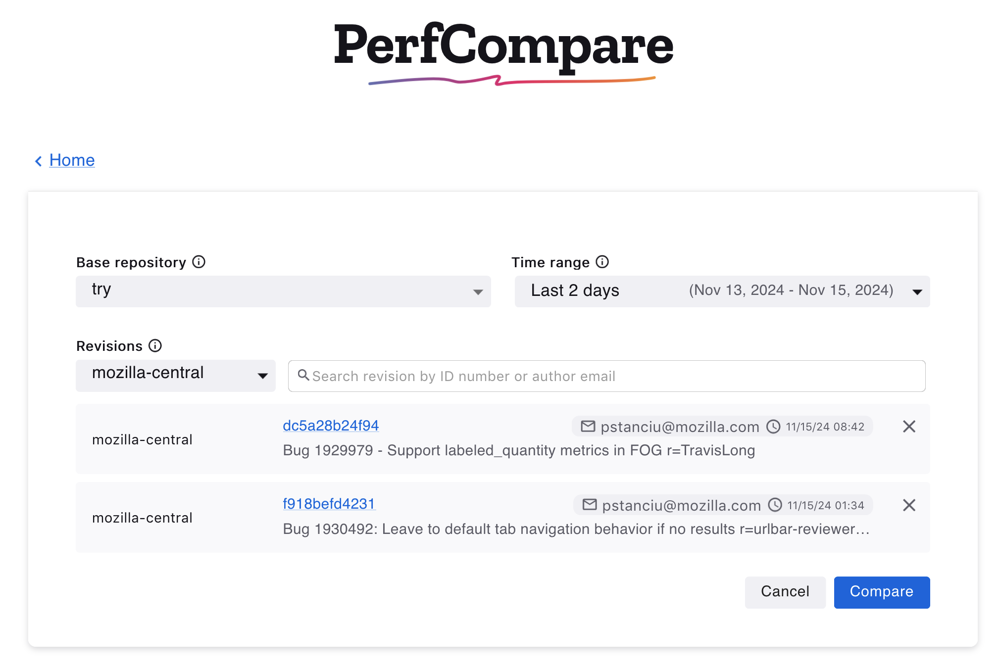
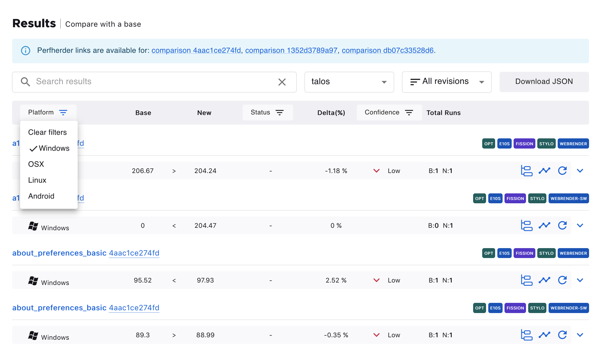
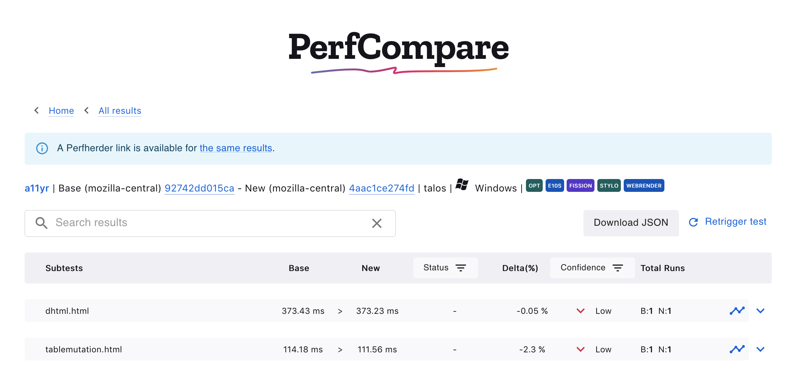
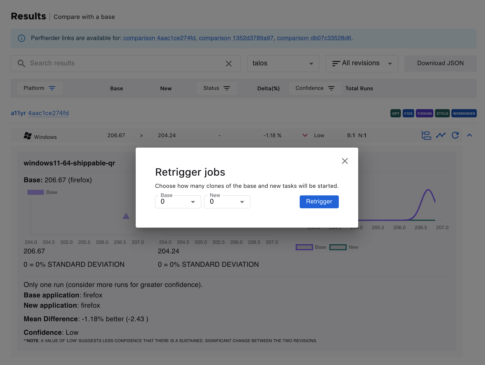

=============
PerfCompare
=============

.. contents::
		:depth: 5
		:local:

PerfCompare is an improved performance comparison tool that will soon replace Perfherder’s Compare View. It allows comparisons of up to three **new** revisions/patches versus the **base** revision of a repository (mozilla-central, autoland, etc). Up to three **new** revisions compared to the **base** repository’s history over time can be selected. The two comparison workflows lead to results indicating whether patches have caused an improvement or regression. The following documentation captures the app’s features and workflows in more detail.

Where can I find PerfCompare?
==============================

Aside from `the website perf.compare <https://perf.compare/>`_, it will be accessible on Perfherder’s Compare View search and results pages.

The source code can be viewed in GitHub's `repository <https://github.com/mozilla/perfcompare>`_.

Home / Search Page
====================

Landing on PerfCompare, two search comparison workflows are available: **Compare with a base** or **Compare over time**.

Compare with a base
--------------------

 .. image:: ./perfcomparehomescreen.png
   :alt: PerfCompare Interface with Three Selected Revisions to Compare with a Base
   :scale: 50%
   :align: center

PerfCompare allows up to three **new** revisions to compare against a **base** revision. The specific testing framework or harness can also be selected.

Compare over time
------------------

It’s also possible to select up to three revisions to compare against a base repository’s history over a specified period.

 .. image:: ./compareovertime.png
   :alt: PerfCompare Selection Interface for Revisions/Pushes to Compare over Time
   :scale: 50%
   :align: center

Results Page
=============

After pressing the Compare button, the Results Page displays the information of the selected revisions and the results table.

Edit the compared revisions
----------------------------

The compared revisions can be edited, and a new comparison can be computed for an updated results table without having to return to the home page. Clicking the **Edit entry** button will open the edit view.

 .. image:: ./resultseditentry.png
   :alt: PerfCompare Results Page Edit Entry Selection
   :scale: 50%
   :align: center

In the edit view, it’s possible to search for revisions or delete selected revisions. The option to cancel and return to the previous selections is available. Otherwise, once satisfied with the changes, clicking **Compare** will update the data in the results table.

.. image:: ./resultseditentryviewbase.png
   :alt: PerfCompare Results Page Compare with a Base Edit Entry View
   :scale: 50%
   :align: center

Like Compare with a base, clicking **Edit Entry** will open the edit view to change selections for the base repository, time range or delete or search for new selected revisions.

Results Table
===============

Please refer to the `Understanding the Results <standard-workflow.html#understanding-the-results>`_ section of the Compare View documentation for information on interpreting the results table.

It’s possible to search the results table by platform, title, or revisions. Other frameworks can be selected to see the results in a different test harness. The **All revisions** dropdown provides options to see the results according to a specific new revision.

.. image:: ./resultstable.png
   :alt: PerfCompare Results Table
   :scale: 50%
   :align: center

The **Download JSON** button generates a json output of the results data.

The results table can be filtered according to Platforms, Status (No Changes, Improvement, or Regression), or Confidence (Low, Medium, High)

Expanded Rows
--------------

Clicking on the **the carrot down** button expands the row

.. image:: ./resultstableexpanded.png
   :alt: PerfCompare Results Table with Expanded Row
   :scale: 50%
   :align: center

In the expanded view, hovering over the points or curve on the graphs shows more information about it.

.. image:: ./resultstableexpandedgraph.png
   :alt: PerfCompare Results Table with Hover Over The Graph
   :scale: 50%
   :align: center

Subtests
---------

When such data is available, clicking on the **subtest icon** opens a new page containing the subtests information for the selected result

Graph view
-----------

Clicking on the **graph icon** opens the graph of the historical data or graph view for the job in a new window on Treeherder.

.. image:: ./resultstableexpandedgraph.png
   :alt: PerfCompare Results Table with Graph View
   :scale: 50%
   :align: center

Here is an example of the graph view after clicking this icon:

.. image:: ./resultstablegraphveiwperfherder.png
   :alt: Historical Graph Data on Perfherder
   :scale: 50%
   :align: center

Retrigger test jobs
===================
It’s possible to retrigger jobs within Taskcluster. Clicking on the **retrigger icon** will show a dialog to choose how many new runs should be started. Note that signing in with valid taskcluster

.. image:: ./resultstableretrigger.png
   :alt: PerfCompare Results Table with Taskcluster Login
   :scale: 50%
   :align: center

