======================
Performance Sheriffing
======================

.. contents::
    :depth: 3

1 Overview
----------

Performance sheriffs are responsible for making sure that performance changes in Firefox are detected
and dealt with. They look at data and performance metrics produced by the performance testing frameworks
and find regressions, determine the root cause, and file bugs to track all issues. The workflow we
follow is shown below in our flowchart.

1.1 Flowchart
~~~~~~~~~~~~~

.. image:: ./flowchart.png
   :alt: Sheriffing Workflow Flowchart
   :align: center

The workflow of a sheriff is backfilling jobs to get the data, investigating that data, filing
bugs/linking improvements based on the data, and following up with developers if needed.

1.2 Contacts and the Team
~~~~~~~~~~~~~~~~~~~~~~~~~
In the event that you have an urgent issue and need help what can you do?

If you have a question about a bug that was filed and assigned to you reach out to the sheriff who filed the bug on
Matrix. If a performance sheriff is not responsive or you have a question about a bug
send a message to the `Performance Sheriffs Matrix channel <https://chat.mozilla.org/#/room/#perfsheriffs:mozilla.org>`_
and tag the sheriff. If you still have no-one responding you can message any of the following people directly
on Slack or Matrix:

- `@afinder <https://people.mozilla.org/p/afinder>`_
- `@andra <https://people.mozilla.org/p/andraesanu>`_
- `@beatrice <https://people.mozilla.org/p/bacasandrei>`_
- `@florin.bilt <https://people.mozilla.org/p/fbilt>`_
- `@sparky <https://people.mozilla.org/p/sparky>`_ (reach out to only if all others unreachable)

All of the team is in EET (Eastern European Time) except for @sparky who is in EST (Eastern Standard Time).

1.3 Regression and Improvement Definition
~~~~~~~~~~~~~~~~~~~~~~~~~~~~~~~~~~~~~~~~~
Whenever we get a performance change we classify it as one of two things, either a regression (worse performance) or
an improvement (better performance).

2 How to Investigate Alerts
---------------------------
In this section we will go over how performance sheriffs investigate alerts.

2.1 Filtering and Reading Alerts
~~~~~~~~~~~~~~~~~~~~~~~~~~~~~~~~
On the `Perfherder page <https://treeherder.mozilla.org/perfherder/alerts>`_ you should see something like below:

.. image:: ./Alerts_view.png
  :alt: Alerts View Toolbar
  :align: center

After accessing the Perfherder alerts page make sure the filter (located in the top middle of the screenshot)
is set to show the correct alerts for sheriffing. The new alerts can be found when
the **untriaged** option from the left-most dropdown is selected. As shown in the screenshot below:

.. image:: ./Alerts_view_toolbar.png
  :alt: Alerts View Toolbar
  :align: center

The rest of the dropdowns from left to right are as follows:

- **Testing harness**: altering this will take you to alerts generated on different harnesses
- **The filter input**, where you can type some text and press enter to narrow down the alerts view
- **"Hide downstream / reassigned to / invalid"**: enable this (recommended) to reduce clutter on the page
- **"My alerts"**: only shows alerts assigned to you.

Below is a screenshot of an alert:

.. image:: ./single_alert.png
  :alt: Alerts View Toolbar
  :align: center

You can tell an alert by looking at the bold text, it will say "Alert #XXXXX", in each alert you have groupings of
summaries of tests, and those tests:

- Can run on different platforms
- Can share suite name (like tp5o)
- Measure various metrics
- Share the same framework

Going from left to right of the columns inside the alerts starting with test, we have:

- A blue hyperlink that links to the test documentation (if available)
- The **platform's** operating system
- **Information** about the historical data distribution of that
- Tags and options related to the test

2.2 Regressions vs Improvements
~~~~~~~~~~~~~~~~~~~~~~~~~~~~~~~
First thing to note about how we investigate alerts is that **we prioritize handling regressions**! Unlike the
**improvements,** regressions ship bugs to users, which, if not addressed, make our products worse and drive users away.
After acknowledging an alert:

- Regressions go through multiple status changes (TODO: link to sections with multiple status changes) until they are finally resolved
- An improvement has a single status of improvement

2.3 Framework Thresholds
~~~~~~~~~~~~~~~~~~~~~~~~
Different frameworks test different things, and the thresholds for triggering alerts and considering
performance changes differ based on the harness:

- AWSY >= 0.25%
- Build metrics installer size >= 100kb
- Talos, Browsertime, Build Metrics >= 2%

3 How to Handle Inactive Alerts
-------------------------------

Inactive performance alerts are those alerts which have had no activity in 1 week. This section covers how performance sheriffs should handle inactive performance alerts that are found in the daily email sent to the `perfalert-activity group <https://groups.google.com/a/mozilla.com/g/perfalert-activity/about>`_.

3.1 Process
~~~~~~~~~~~

The following is the general process that needs to be taken for the alerts in the email:

 #. Open the email titled ``[bugbot][autofix] PerfAlert regressions with 1 week(s) of inactivity for the DATE`` to find bugs that are inactive.

    - These occur at most daily.

 #. Open one of the bugs mentioned in the email.

 #. Check if the developer has previously responded to the bug.

 #. Find the developer (regression author) being needinfo’ed by the BugBot.

 #. (Optional) Check on `people.mozilla.org <https://people.mozilla.org>`_ to find the person’s Matrix/Slack information if needed.

 #. Find the developer in a public channel.

    - ``#developers`` on Matrix is the most likely place you can find them.

 #. Reach out to them with a message like the following:

    - **If the patch has had a response from the regressor author:**

      ::

       Hello, could you provide an update on this performance regression or close it if it makes sense to (with a follow-up bug if needed)? <PERFORMANCE-ALERT-BUG-LINK>

    - **If the patch has never had a response from the regressor author:**

      ::

       Hello, could you provide an update on this performance regression or close it if it makes sense to (with a follow-up bug if needed)? In accordance with our `regression policy <https://www.mozilla.org/en-US/about/governance/policies/regressions/>`_, we're considering backing out your patch due to a lack of comments/activity: <PERFORMANCE-ALERT-BUG-LINK>

3.2 Handling Responses
~~~~~~~~~~~~~~~~~~~~~~

For Bugs with a Response from the Regressor Author
^^^^^^^^^^^^^^^^^^^^^^^^^^^^^^^^^^^^^^^^^^^^^^^^^^

Depending on the developer's response, one of four things may happen:

 #. **Developer provides an update on the alert bug:**

    - No other action is needed. If this has happened multiple times on the bug, you can add the ``backlog-deferred`` keyword to prevent the BugBot rule from triggering again on the alert.

 #. **Developer asks for clarification on the process or isn’t sure what to do:**

    - Point them to this documentation. Explain the possible resolutions and what we expect of them.

 #. **Developer does not respond:**

    - Wait for 1 full business day for the response. If there is still no response, find and ping their manager (can be in private) from `people.mozilla.org <https://people.mozilla.org>`_.

      - If there is a response from the manager, you can proceed with one of the other options.

 #. **Developer does not want to close the bug and needs time to investigate:**

    - Add the ``backlog-deferred`` keyword to prevent BugBot from triggering on this bug again in the future.

For Bugs with No Previous Response from the Regressor Author
^^^^^^^^^^^^^^^^^^^^^^^^^^^^^^^^^^^^^^^^^^^^^^^^^^^^^^^^^^^^

Depending on the developer's response, one of five things may happen:

 #. **Developer agrees to a backout:**

    - Reach out to a sheriff in ``#sheriffs`` on Matrix to request the backout.

      - Ensure that they understand that if they’re actively working on it, they can provide an update on the alert bug to prevent a backout.
      - Ensure that they understand that they can close the bug with ``WONTFIX``/``INCOMPLETE`` if they aren’t actively working on it, or they think it isn’t a big issue. They can file a follow-up bug to look into the issue further in the future. If it's been determined that there is no actual performance issue but there was a detection, they could close the bug as ``WORKSFORME``.

 #. **Developer provides an update on the alert bug:**

    - No other action is needed. If this has happened multiple times on the bug, you can add the ``backlog-deferred`` keyword to prevent the BugBot rule from triggering again on the alert.

 #. **Developer asks for clarification on the process or isn’t sure what to do:**

    - Point them to this documentation. Explain the possible resolutions and what we expect of them.

 #. **Developer does not respond:**

    - Wait for 1 full business day for the response. If there is still no response, find and ping their manager (can be in private) from `people.mozilla.org <https://people.mozilla.org>`_.

      - If there is a response from the manager/developer, you can proceed with one of the other options. If not, request a backout.

 #. **Developer does not want to close the bug and needs time to investigate:**

    - Ask them to provide a comment in the bug stating this. Add the ``backlog-deferred`` keyword to prevent the BugBot from triggering on this bug again in the future.

4 FAQ
-----

What is Perfherder?
~~~~~~~~~~~~~~~~~~~

`Perfherder <https://treeherder.mozilla.org/perf.html#/graphs>`_ is a tool that takes data points from log files and graphs them over time.
Primarily this is used for performance data from `Talos <https://wiki.mozilla.org/TestEngineering/Performance/Talos>`_, but also from `AWSY <https://firefox-source-docs.mozilla.org/testing/perfdocs/awsy.html>`_, build_metrics, `Autophone <https://wiki.mozilla.org/EngineeringProductivity/Autophone>`_ and platform_microbenchmarks.
All these are test harnesses and you can find more about them `here <https://wiki.mozilla.org/TestEngineering/Performance/Sheriffing/Alerts>`_.

The code for Perfherder can be found inside Treeherder `on GitHub <https://github.com/mozilla/treeherder/>`_.

How can I view details on a graph?
~~~~~~~~~~~~~~~~~~~~~~~~~~~~~~~~~~

When viewing Perfherder Graph details, in many cases it is obvious where the regression is. If you mouse over the data points (not click on them) you can see some raw data values.

While looking for the specific changeset that caused the regression, you have to determine where the values changed. By moving the mouse over the values you can easily determine the high/low values historically to determine the normal 'range'. When you see values change, it should be obvious that the high/low values have a different 'range'.

If this is hard to see, it helps to zoom in to reduce the 'y' axis. Also zooming into the 'x' axis for a smaller range of revisions yields less data points, but an easier way to see the regression.

Once you find the regression point, you can click on the data point and it will lock the information as a popup. Then you can click on the revision to investigate the raw changes which were part of that.

.. image:: ./Ph_Details.png
   :alt: Ph_Details
   :align: center

Note, here you can get the date, revision, and value. These are all useful data points to be aware of while viewing graphs.

Keep in mind, graph server doesn't show if there is missing data or a range of changesets.

How can I zoom on a perfherder graph?
~~~~~~~~~~~~~~~~~~~~~~~~~~~~~~~~~~~~~

Perfherder graphs has the ability adjust the date range from a drop down box. We default to 14 days, but we can change it to last day/2/7/14/30/90/365 days from the UI drop down.

It is usually a good idea to zoom out to a 30 day view on integration branches. This allows us to see recent history as well as what the longer term trend is.

There are two parts in the Perfherder graph, the top box with the trendline and the bottom viewing area with the raw data points. If you select an area in the trendline box, it will zoom to that. This is useful for adjusting the Y-axis.

Here is an example of zooming in on an area:

.. image:: ./Ph_Zooming.png
   :alt: Ph_Zooming
   :align: center

How can I add more test series to a graph?
~~~~~~~~~~~~~~~~~~~~~~~~~~~~~~~~~~~~~~~~~~

One feature of Perfherder graphs is the ability to add up to 7 sets of data points at once and compare them on the same graph. In fact when clicking on a graph for an alert, we do this automatically when we add multiple branches at once.

While looking at a graph, it is a good idea to look at that test/platform across multiple branches to see where the regression originally started at and to see if it is affected on different branches. There are 3 primary needs for adding data:

- investigating branches
- investigating platforms
- comparing pgo/non pgo/e10s for the same test

For investingating branches click the branch name in the UI and it will pop up the "Add more test data" dialog pre populated with the other branches which has data for this exact platform/test. All you have to do is hit add.

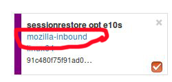

For investigating platforms, click the platform name in the UI and it will pop up the "Add more test data" dialog pre populated with the other platforms which has data for this exact platform/test. All you have to do is hit add.

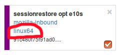

To do this find the link on the left hand side where the data series are located at "+Add more test data":

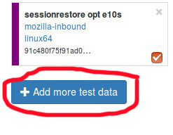

How can a test series can be muted/hidden?
~~~~~~~~~~~~~~~~~~~~~~~~~~~~~~~~~~~~~~~~~~

A test series from a perfherder graph can be muted/hidden by toggling on the checkbox on the lower right of the data series from the left side panel.

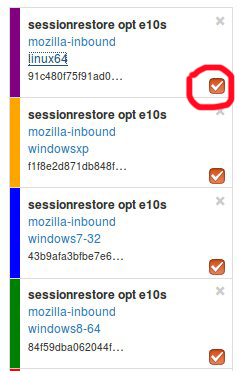

What makes branches different from one another?
~~~~~~~~~~~~~~~~~~~~~~~~~~~~~~~~~~~~~~~~~~~~~~~

We have a variety of branches at Mozilla, here are the main ones that we see alerts on:

- Mozilla-Inbound (PGO, Non-PGO)
- Autoland (PGO, Non-PGO)
- Mozilla-Beta (all PGO)

Linux and Windows builds have `PGO <#what-is-pgo>`_, OSX does not.

When investigating alerts, always look for the Non-PGO branch first. Usually expect to find changes on Mozilla-Inbound (about 50%) and Autoland (50%).

The volume on the branches is something to be aware of, we have higher volume on Mozilla-Inbound and Autoland, this means that alerts will be generated faster and it will be easier to track down the offending revision.

A final note, Mozilla-Beta is a branch where little development takes place. The volume is really low and alerts come 5 days (or more) later. It is important to address Mozilla-Beta alerts ASAP because that is what we are shipping to customers.

What is coalescing?
~~~~~~~~~~~~~~~~~~~

Coalescing is a term we use for when we schedule jobs to run on a given machine. When the load is high these jobs are placed in a queue and the longer the queue we skip over some of the jobs. This allows us to get results on more recent changesets faster.

This affects talos numbers as we see regressions which show up over >1 changeset that is pushed. We have to manually fill in the coalesced jobs (including builds sometimes) to ensure we have the right changeset to blame for the regression.

Some things to be aware of:

- missing test jobs - This could be as easy as waiting for jobs to finish, or scheduling the missing job assuming it was coalesced, otherwise, it could be a missing build.
- missing builds - we would have to generate builds, which automatically schedules test jobs, sometimes these test jobs are coalesced and not run.
- results might not be possible due to build failures, or test failures
- `pgo builds <What-is-PGO?>`_ are not coalesced, they just run much less frequently. Most likely a pgo build isn't the root cause

Here is a view on treeherder of missing data (usually coalescing):

.. image:: ./Coalescing_markedup.png
   :alt: Coalescing_markedup
   :align: center

Note the two pushes that have no data (circled in red). If the regression happened around here, we might want to backfill those two jobs so we can ensure we are looking at the push which caused the regression instead of >1 push.

What is an uplift?
~~~~~~~~~~~~~~~~~~

Every `6 weeks <https://whattrainisitnow.com/calendar/>`_ we release a new version of Firefox. When we do that, our code which developers check into the nightly branch gets uplifted (thing of this as a large `merge <#what-is-a-merge>`_) to the Beta branch. Now all the code, features, and Talos regressions are on Beta.

This affects the Performance Sheriffs because we will get a big pile of alerts for Mozilla-Beta. These need to be addressed rapidly. Luckily almost all the regressions seen on Mozilla-Beta will already have been tracked on Mozilla-Inbound or Autoland.

- Regressions go through multiple status changes (TODO: link to sections with multiple status changes) until they are finally resolved
- An improvement has a single status of improvement

What is a merge?
~~~~~~~~~~~~~~~~

Many times each day we merge code from the integration branches into the main branch and back. This is a common process in large projects. At Mozilla, this means that the majority of the code for Firefox is checked into Mozilla-Inbound and Autoland, then it is merged into Mozilla-Central (also referred to as Firefox) and then once merged, it gets merged back into the other branches. If you want to read more about this merge procedure, here are `the details <https://wiki.mozilla.org/Sheriffing/How_To/Merges>`_.

.. image:: ./Merge.png
   :alt: Merge
   :align: center

Note that the topmost revision has the commit messsage of: "merge m-c to m-i". This is pretty standard and you can see that there are a series of `changesets <https://hg-edge.mozilla.org/integration/mozilla-inbound/pushloghtml?changeset=126a1ec5c7c5>`_, not just a few related patches.

How this affects alerts is that when a regression lands on Mozilla-Inbound, it will be merged into Firefox, then Autoland. Most likely this means that you will see duplicate alerts on the other integration branch.

- note: we do not generate alerts for the Firefox (Mozilla-Central) branch.

What is a backout?
~~~~~~~~~~~~~~~~~~

Many times we backout or hotfix code as it is causing a build failure or unittest failure. The `Sheriff team <https://wiki.mozilla.org/Sheriffing/Sheriff_Duty>`_ handles this process in general and backouts/hotfixes are usually done within 3 hours (i.e. we won't have `12 future changesets <#why-do-we-need-12-future-data-points>`_) of the original fix. As you can imagine we could get an alert 6 hours later and go to look at the graph and see there is no regression, instead there is a temporary spike for a few data points.

While looking on TreeHerder for a backout, they all mention a backout in the commit message:

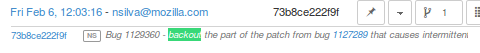

- note ^ the above image mentions the bug that was backed out, sometimes it is the revisoin.

Backouts which affect `Perfherder alerts <https://wiki.mozilla.org/TestEngineering/Performance/Sheriffing/Alerts>`_ always generate a set of improvements and regressions. These are usually easy to spot on the graph server and we just need to annotate the set of alerts for the given revision to be a 'backout' with the bug to track what took place.

Here is a view on graph server of what appears to be a backout (it could be a fix that landed quickly also):

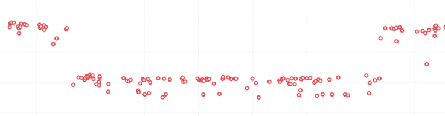

What is PGO?
~~~~~~~~~~~~

PGO is Profile Guided Optimization `Profile Guided Optimization <https://wiki.mozilla.org/TestEngineering/Performance/Sheriffing/Alerts>`_ where we do a build, run it to collect metrics and optimize based on the output of the metrics. We only release PGO builds, and for the integration branches we do these periodically (6 hours) or as needed. For Mozilla-Central we follow the same pattern. As the builds take considerably longer (2+ times as long) we don't do this for every commit into our integration branches.

How does this affect alerts? We care most about PGO alerts- that is what we ship! Most of the time an alert will be generated for a -Non-PGO build and then a few hours or a day later we will see alerts for the PGO build.

Pay close attention to the branch the alerts are on, most likely you will see it on the non-pgo branch first (i.e. Mozilla-Inbound-Non-PGO), then roughly a day later you will see a similar alert show up on the PGO branch (i.e. Mozilla-Inbound).

Caveats:

- OSX does not do PGO builds, so we do not have -Non-PGO branches for those platforms. (i.e. we only have Mozilla-Inbound)
- PGO alerts will probably have different regression percentages, but the overall list of platforms/tests for a given revision will be almost identical

What alerts are displayed in Alert Manager?
~~~~~~~~~~~~~~~~~~~~~~~~~~~~~~~~~~~~~~~~~~~

Perfherder `alerts <https://treeherder.mozilla.org/perf.html#/alerts>`_ defaults to `multiple types of alerts <https://wiki.mozilla.org/TestEngineering/Performance/Sheriffing/Alerts>`_ that are untriaged. It is a goal to keep these lists empty! You can view alerts that are improvements or in any other state (i.e. investigating, fixed, etc.) by using the drop down at the top of the page.

Do we care about all alerts/tests?
~~~~~~~~~~~~~~~~~~~~~~~~~~~~~~~~~~

Yes we do. Some tests are more commonly invalid, mostly due to the noise in the tests. We also adjust the threshold per test, the default is 2%, but for Dromaeo it is 5%. If we consider a test too noisy, we consider removing it entirely.

Here are some platforms/tests which are exceptions about what we run:

- Linux 64bit - the only platform which we run dromaeo_dom
- Linux 32/64bit - the only platform in which no `platform_microbench <https://wiki.mozilla.org/TestEngineering/Performance/Sheriffing/Alerts#platform_microbench>`_ test runs, due to high noise levels
- Windows 7 - the only platform that supports xperf (toolchain is only installed there)
- Windows 7/10 - heavy profiles don't run here, because they take too long while cloning the big profiles; these are tp6 tests that use heavy user profiles

Lastly, we should prioritize alerts on the Mozilla-Beta branch since those are affecting more people.

What does a regression look like on the graph?
~~~~~~~~~~~~~~~~~~~~~~~~~~~~~~~~~~~~~~~~~~~~~~

On almost all of our tests, we are measuring based on time. This means that the lower the score the better. Whenever the graph increases in value that is a regression.

Here is a view of a regression:

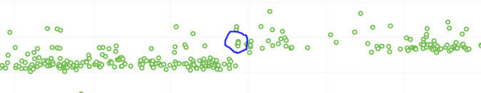

We have some tests which measure internal metrics. A few of those are actually reported where a higher score is better. This is confusing, but we refer to these as reverse tests. The list of tests which are reverse are:

- canvasmark
- dromaeo_css
- dromaeo_dom
- rasterflood_gradient
- speedometer
- tcanvasmark
- v8 version 7

Here is a view of a reverse regression:

.. image:: ./Reverse_regression.png
   :alt: Reverse_regression
   :align: center

Why does Alert Manager print -xx% ?
~~~~~~~~~~~~~~~~~~~~~~~~~~~~~~~~~~~

The alert will either be a regression or an improvement. For the alerts we show by default, it is regressions only. It is important to know the severity of an alert. For example a 3% regression is important to understand, but a 30% regression probably needs to be fixed ASAP. This is annotated as a XX% in the UI. there are no + or - to indicate improvement or regression, this is an absolute number. Use the bar graph to the side to determine which type of alert this is.

NOTE: for the reverse tests we take that into account, so the bar graph will know to look in the correct direction.

What is noise?
~~~~~~~~~~~~~~

Generally a test reports values that are in a range instead of a consistent value. The larger the range of 'normal' results, the more noise we have.

Some tests will post results in a small range, and when we get a data point significantly outside the range, it is easy to identify.

The problem is that many tests have a large range of expected results (we call them unstable). It makes it hard to determine what a regression is when we might have a range += 4% from the median and we have a 3% regression. It is obvious in the graph over time, but hard to tell until you have many future data points.

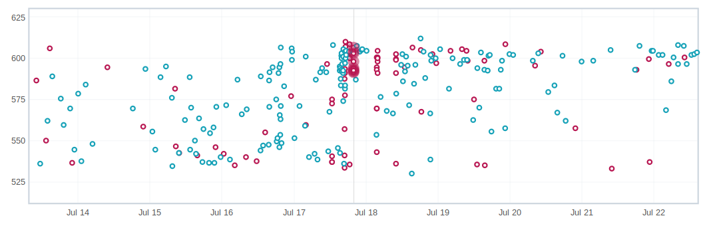

What are low value tests?
~~~~~~~~~~~~~~~~~~~~~~~~~

In the context of noise, the low value mean that the regression magnitude is too small related to the noise of the tests, thus it's pretty hard to tell which particular bug/commit caused this, but rather a range.
In a sheriffing perspective, those often end up as WONTFIX/INVALID or tests which are often considered unreliable, not relevant to current Firefox revision etc.

.. image:: ./Noisy_low_value_graph.png
   :alt: Noisy_low_value_graph
   :align: center

Why can we not trust a single data point?
~~~~~~~~~~~~~~~~~~~~~~~~~~~~~~~~~~~~~~~~~

This is a problem we have dealt with for years with no perfect answer. Some reasons we do know are:

- the test is noisy due to timing, diskIO, etc.
- the specific machine might have slight differences
- sometimes we have longer waits starting the browser or a pageload hang for a couple extra seconds

The short answer is we don't know and have to work within the constraints we do know.

Why do we need 12 future data points?
~~~~~~~~~~~~~~~~~~~~~~~~~~~~~~~~~~~~~

We are re-evaluating our assertions here, but the more data points we have, the more confidence we have in the analysis of the raw data to point out a specific change.

This causes problem when we land code on Mozilla-Beta and it takes 10 days to get 12 data points. We sometimes rerun tests and just retriggering a job will help provide more data points to help us generate an alert if needed.

Can't we do smarter analysis to reduce noise?
~~~~~~~~~~~~~~~~~~~~~~~~~~~~~~~~~~~~~~~~~~~~~

Yes, we can. We have other projects and a masters thesis `masters thesis <https://wiki.mozilla.org/images/c/c0/Larres-thesis.pdf>`_ has been written on this subject. The reality is we will still need future data points to show a trend and depending on the source of data we will need to use different algorithms to analyze it.

How can duplicate alerts can be identified?
~~~~~~~~~~~~~~~~~~~~~~~~~~~~~~~~~~~~~~~~~~~

One problem with `coalescing <#what-is-coalescing>`_ is that we sometimes generate an original alert on a range of changes, then when we fill in the data (backfilling/retriggering) we generate new alerts. This causes confusion while looking at the alerts.

Here are some scenarios which duplication will be seen:

- backfilling data from `coalescing <#what-is-coalescing>`_, you will see a similar alert on the same branch/platform/test but a different revision
    - action: reassign the alerts to the original alert summary so all related alerts are in one place!
- we merge changesets between branches
    - action: find the original alert summary on the upstream branch and mark the specific alert as downstream to that alert summary
- `pgo <#what-is-pgo>`_ builds
    - action: reassign these to the non-pgo alert summary (if one exists), or downstream to the correct alert summary if this originally happened on another branch

In Alert Manager it is good to acknowledge the alert and use the reassign or downstream actions. This helps us keep track of alerts across branches whenever we need to investigate in the future.

What are weekend spikes?
~~~~~~~~~~~~~~~~~~~~~~~~

On weekends (Saturday/Sunday) and many holidays, we find that the volume of pushes are much smaller. This results in much fewer tests to be run. For many tests, especially ones that are noisier than others, we find that the few data points we collect on a `weekend are much less noisy <https://elvis314.wordpress.com/2014/10/30/a-case-of-the-weekends/>`_ (either falling to the top or bottom of the noise range).

Here is an example view of data that behaves differently on weekends:

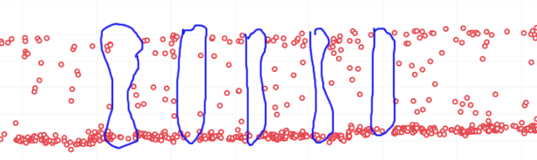

This affects the Talos Sheriff because on Monday when our volume of pushes picks up, we get a larger range of values. Due to the way we calculate a regression, it means that we see a shift in our expected range on Monday. Usually these alerts are generated Monday evening/Tuesday morning. These are typically small regressions (<3%) and on the noisier tests.

What is a multi-modal test?
~~~~~~~~~~~~~~~~~~~~~~~~~~~

Many tests are bi-modal or multi-modal. This means that they have a consistent set of values, but 2 or 3 of them. Instead of having a bunch of scattered values between the low and high, you will have 2 values, the lower one and the higher one.

Here is an example of a graph that has two sets of values (with random ones scattered in between):

.. image:: ./Modal_example.png
   :alt: Modal_example
   :align: center

This affects the alerts and results because sometimes we get a series of results that are less modal than the original- of course this generates an alert and a day later you will probably see that we are back to the original x-modal pattern as we see historically. Some of this is affected by the weekends.

What is random noise?
~~~~~~~~~~~~~~~~~~~~~

Random noise are the data-points that don't fit in the graph trend of the test. They happen because of various uncontrollable factors (and this is assumed) or because the test is unstable.

How do I identify the current firefox release meta-bug?
~~~~~~~~~~~~~~~~~~~~~~~~~~~~~~~~~~~~~~~~~~~~~~~~~~~~~~~

To easily track all the regressions opened, for every Firefox release is created a meta-bug that will depend on the regressions open.

.. image:: ./Advanced_search.png
   :alt: Advanced_search
   :align: center

To find all the Firefox release meta-bugs you just have to search in Advanced search for bugs with:

.. image:: ./Firefox_70_meta.png
   :alt: SFirefox_70_meta
   :align: center

**Product:** Testing
**Component:** Performance
**Summary:** Contains all of the strings [meta] Firefox, Perfherder Regression Tracking Bug You can leave the rest of the fields as they are.

.. image:: ./Advanced_search_filter.png
   :alt: Advanced_search_filter
   :align: center

**Result:**

.. image:: ./Firefox_metabugs.png
   :alt: Firefox_metabugs
   :align: center

How do I search for an already open regression?
~~~~~~~~~~~~~~~~~~~~~~~~~~~~~~~~~~~~~~~~~~~~~~~

Sometimes treeherder include alerts related to a test in the same summary, sometimes it doesn’t. To make sure that the regression you found doesn’t have already a bug open, you have to search in the current Firefox release meta-bug for regressions open with the summary similar to the summary of your alert. Usually, if the test name matches, it might be what you’re looking for. But, be careful, if the test name matches that doesn’t mean that it is what you’re looking for. You need to check it thoroughly.

Those situations appear because a regression appears first on one repo (e.g. autoland) and it takes a few days until the causing commit gets merged to other repos (inbound, beta, central).

How do I follow up on already open regressions open by me?
~~~~~~~~~~~~~~~~~~~~~~~~~~~~~~~~~~~~~~~~~~~~~~~~~~~~~~~~~~

You can follow up on all the open regression bugs created by you by searching in `Advanced search <https://bugzilla.mozilla.org/query.cgi?format=advanced>`_ for bugs with:
**Summary:** contains all of the strings > regression on push

**Status:** NEW, ASSIGNED, REOPENED

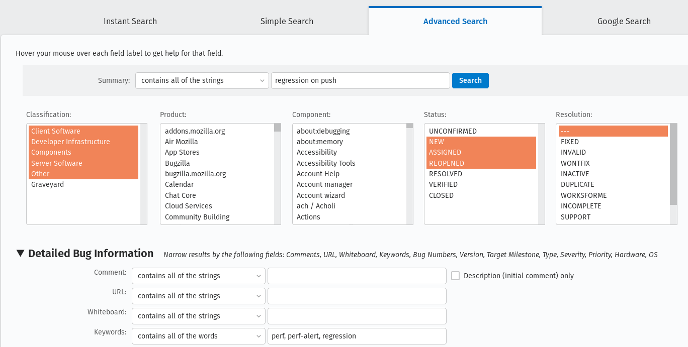

**Keywords:** perf, perf-alert, regression

**Type:** defect

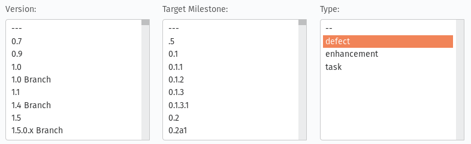

**Search by People:** The reporter is > [your email]

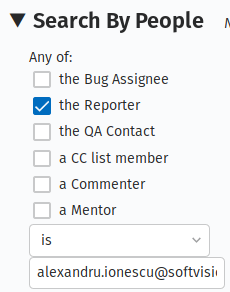

And you will get the list of all open regressions reported by you:

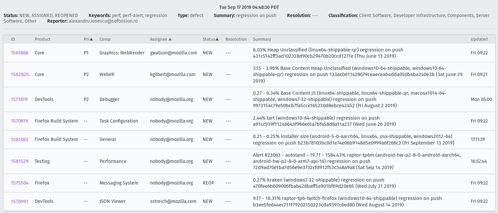

How can I do a bisection?
~~~~~~~~~~~~~~~~~~~~~~~~~

If you're investigating a regression/improvement but for some reason it happened in a revision interval where the jobs aren't able to run or the revision contains multiple commits (this happens more often on mozilla-beta), you need to do a bisection in order to find the exact culprit. We usually adopt the binary search method. Say you have the revisions:

- abcde1 - first regressed/improved value
- abcde2
- abcde3
- abcde4
- abcde5 - last good value

Bisection steps:

1. checkout to the repository you're investigating:
    1.hg checkout autoland (if you don't have it locally you need to do > hg pull autoland && hg update autoland)
2. hg checkout abcde5
    1. ./mach try fuzzy --full -q=^investigated-test-signature -m=baseline_abcde5_alert_###### (you will know that the baseline contains the reference value)
3. hg checkout abcde3
    1. let's assume that build abcde4 broke the tests. you need to back it out in order to get the values of your investigated test on try:
        1. hg backout -r abcde4
    2. ./mach try fuzzy --full -q=^investigated-test-signature -m=abcde4_alert_###### (the baseline keyword is included just in the reference push message)
    3. Use the `perfcompare <https://perf.compare/>`_ to compare between the 2 pushes.
4. If the try values between abcde5 and abcde3 don't include the delta, then you'll know that abcde1 or abcde2 are suspects so you need to repeat the step you did for abcde3 to find out.
