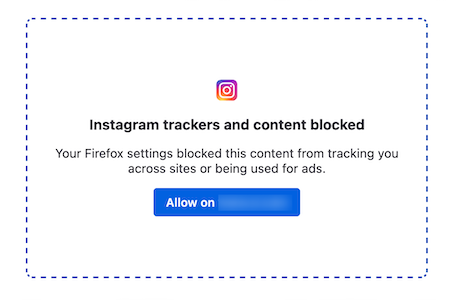
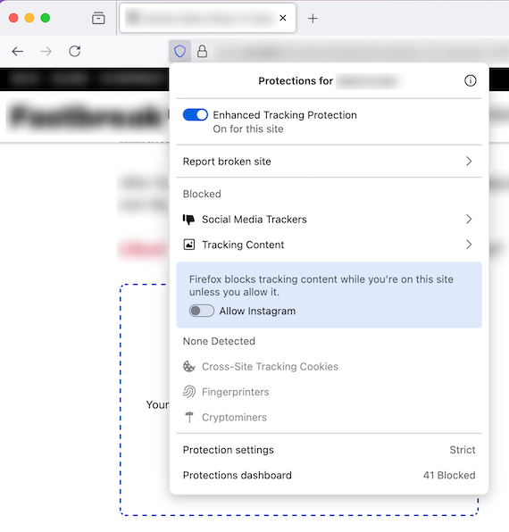

# SmartBlock Embeds

SmartBlock Embeds is an anti-tracking feature that allows the user to opt-in to viewing supported embeds by unblocking their corresponding scripts. These scripts are frequently blocked in modes with higher tracking protections like ETP Strict because they often track the user across sites, but are also necessary for the embeds to load properly. Allowing the user to opt-in to viewing these embeds lets users access more functionality in higher protection modes and allows them to stay in these modes for longer. Though opting in technically reduces privacy protections, the alternative would be to switch to a lower protection mode thus sacrificing a larger amount of privacy protections.

## Technical Information

### Terminology

Some basic terminology that is reused when discussing SmartBlock Embeds:
- **SmartBlock Embeds**: Name of the feature that specifically replaces embeds on a page and allows the user to unblock the embed.
- **SmartBlock**: The name of the more general feature that shims tracking scripts to restore website functionality. SmartBlock Embeds is one part of SmartBlock
- **SmartBlock shim**: The script which replaces a blocked tracker script.
- **SmartBlock placeholder**: The embedded element that is displayed on the page instead of the original embed.

### Feature Prefs

This feature can be toggled using `extensions.webcompat.smartblockEmbeds.enabled` where `true` enables the feature while `false` disables it.

SmartBlock Embeds can also be toggled for each individual embed using the preferences in the `about:compat` page. Additionally, disabling webcompat shims using `extensions.webcompat.enable_shims` will also disable SmartBlock Embeds.

### How does it work?

SmartBlock Embeds relies on and extends the existing Smartblock shim infrastructure from the Webcompat extension.

On a high level, there are two parts to Smartblock Embeds: the shims and the protections panel toggles.

The shim replaces the script that is reponsible for loading the content of the embed. Instead of loading the embed like the original script would, the shim replaces the embed with a placeholder. The placeholder includes a button that directs the user to the protections panel.

In the protections panel, we include a toggle for each type of embed that got replaced. If/when the user clicks the toggle in the protections panel to unblock the request, the shim will put the original embeds back and load the tracker script which will subsequently load the embeds like normal.

Below is a more detailed step by step overview of how SmartBlock Embeds blocks and unblocks embeds.

1. Website sends the network request for an embed's script
2. Request for the embed's script is intercepted by the Webcompat extension and extension replaces the script with the SmartBlock Embed shim
3. SmartBlock Embed shim replaces all embeds on the page with placeholders
4. User clicks the button on the placeholder which opens the protections panel through the Webcompat extension's privileged API
5. User sets the toggle to on in the protections panel which sends an 'unblock' message to the shim through the privileged API
6. Shim recieves the message and replaces the placeholders with the original embeds
7. Shim loads the embed script which populates the embedded content
8. User opens protections panel and sets the toggle to off which triggers a page reload and the process starts over again
