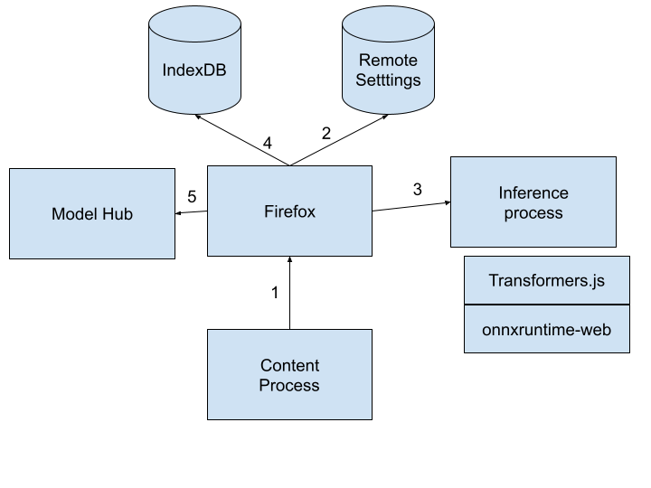

.. _inference-architecture:

Architecture
============

The Firefox AI Platform uses the ONNX runtime to run models, and leverages
the Transformers.js library to simplify the inference work.

   Firefox AI Platform Architecture

(1)(2) When a content process calls the inference API, Firefox calls the Remote Settings
service to get ONNX WASM runtime if needed, and to get default options for the
inference task that is going to be executed.

(3) Firefox then creates an inference process which is a specific type of content process.
That process loads the Transformers.js and ONNX WASM runtime. It then triggers the inference call.

(4) The Transformers.js library will ask for model files depending on the
inference task to perform and the different options that were passed.
These calls are relayed to Firefox, which will look at what is available in
IndexDB. If the required files are present, it will return them to the inference
process.

(5) If they are not, it will trigger the download process by visiting the
Model Hub. And store then in IndexDB
